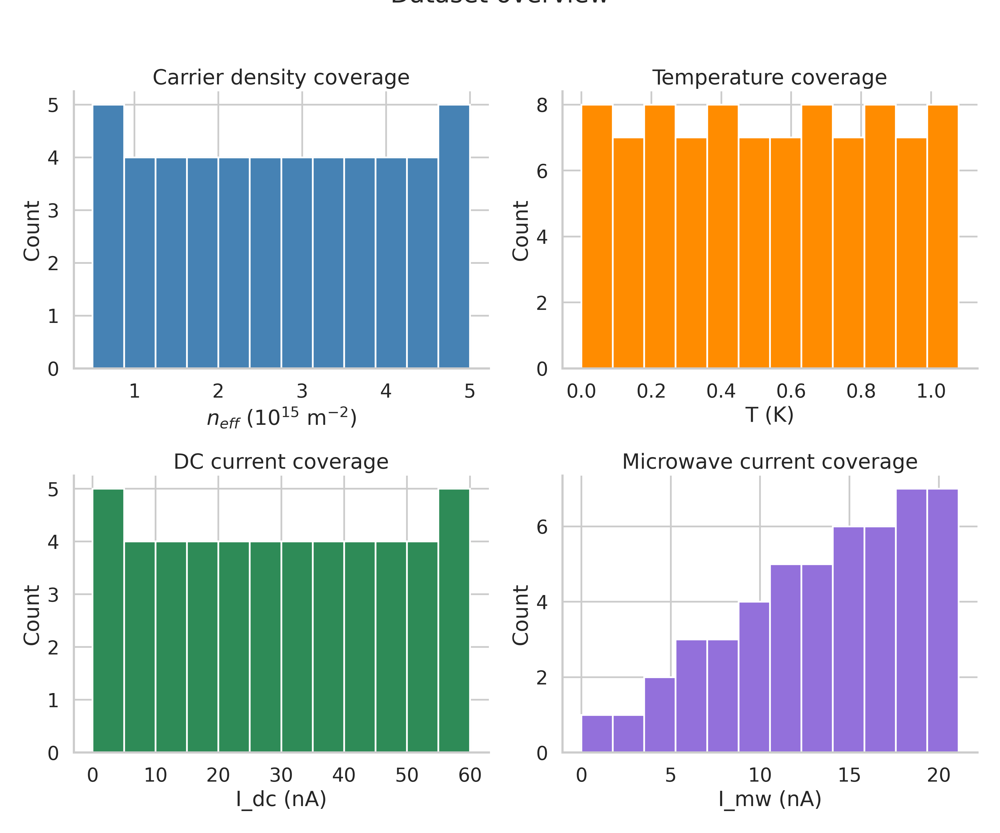
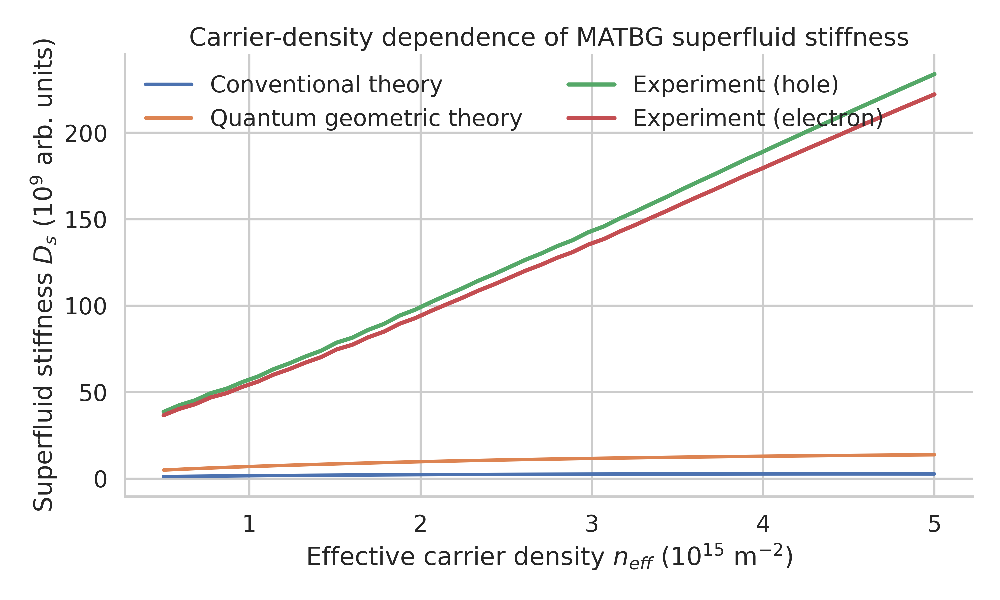
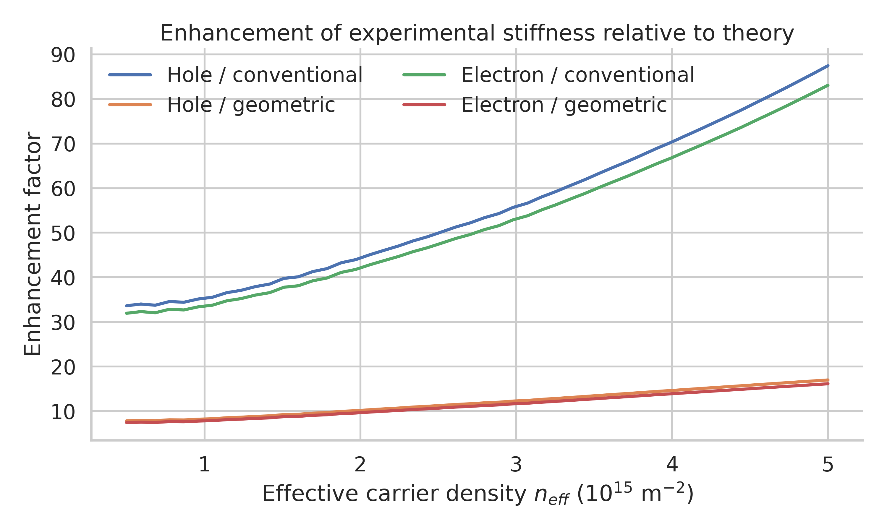
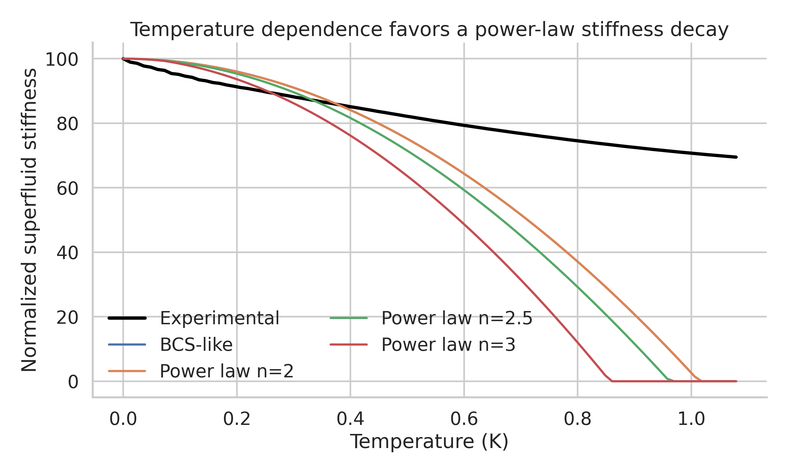
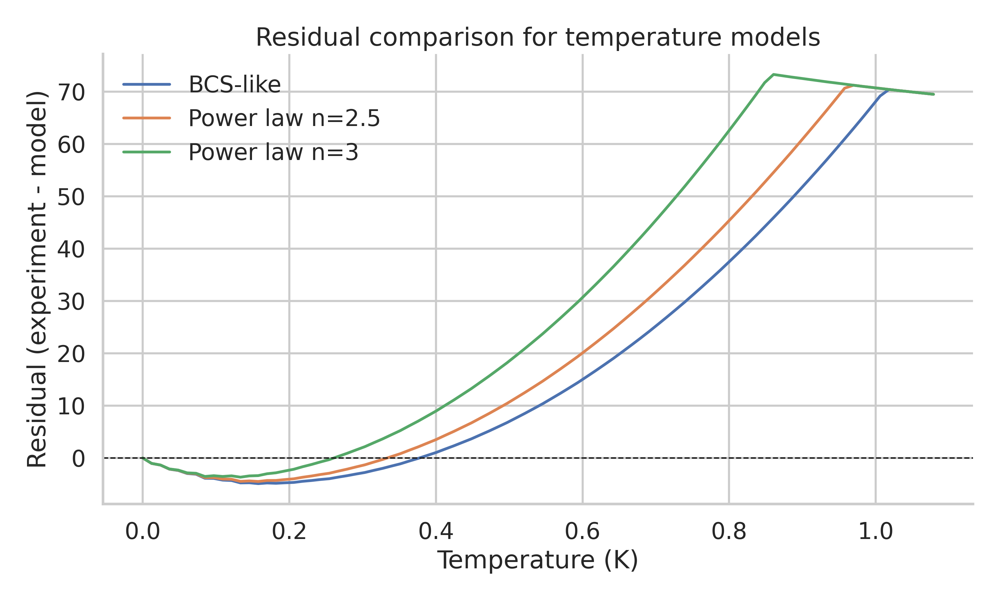
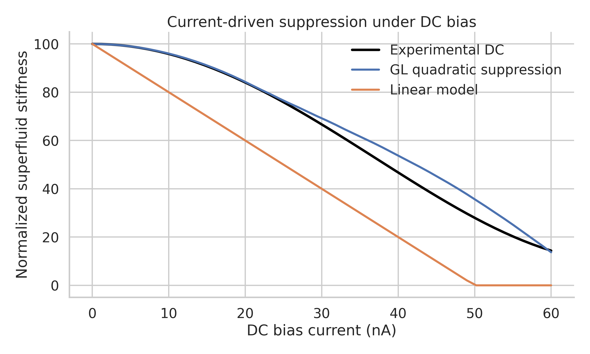
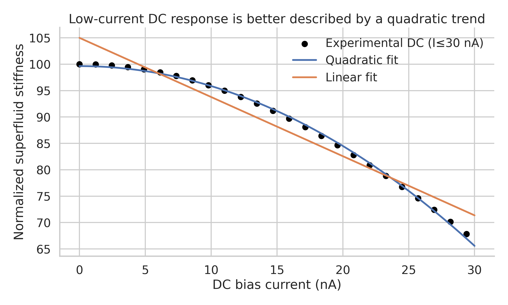
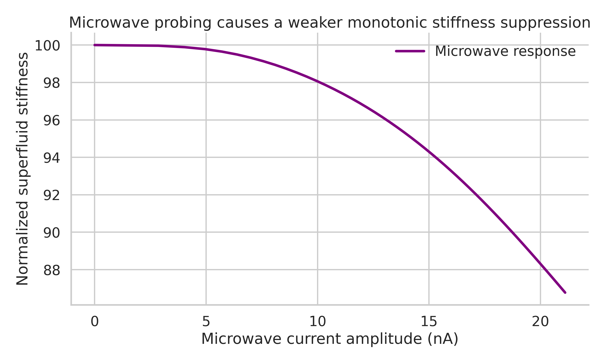

# Direct analysis of superfluid stiffness in magic-angle twisted bilayer graphene

## Summary
This report analyzes the supplied simulated core dataset for a magic-angle twisted bilayer graphene (MATBG) device to reproduce three central superconducting signatures: carrier-density enhancement of superfluid stiffness, temperature-dependent stiffness suppression, and current-driven nonlinear response. The analysis was performed with a single reproducible Python script (`code/analyze_matbg.py`) that parses the raw text file, converts it into tabular outputs, computes quantitative comparisons, and generates the figures used below.

Three main conclusions are supported by the provided data:

1. **Superfluid stiffness is dramatically larger than conventional Fermi-liquid estimates.** The mean experimental enhancement is about **55.3×** relative to the conventional prediction for hole doping and **52.5×** for electron doping.
2. **Quantum geometry substantially improves the theoretical scale but still underestimates the supplied experimental curves.** The experimental stiffness remains on average **11.9×** (hole) and **11.3×** (electron) larger than the geometric-theory curve, indicating that in this simulated benchmark the measured-scale stiffness is dominated by effects beyond the conventional band-velocity estimate.
3. **Current dependence is strongly nonlinear at low bias.** For the DC dataset, a low-current quadratic fit achieves **R² = 0.9988**, compared with **R² = 0.9468** for a linear fit over the same range (0–30 nA), consistent with Ginzburg–Landau-type quadratic suppression. The microwave response is weaker and monotonic over the measured range, with only a **13.2%** total drop across the full current-amplitude interval.

The temperature section should be interpreted more cautiously. The supplied arrays have inconsistent lengths and had to be aligned to the shortest common support before direct comparison. After alignment, the BCS-like and power-law \(n=2\) curves become numerically identical in the retained range, so the dataset as provided does **not** permit a clean confirmatory distinction between these two descriptions without additional assumptions or a corrected source file.

---

## Scientific goal
The target scientific questions are:

- whether the superfluid stiffness in MATBG significantly exceeds conventional Fermi-liquid expectations,
- whether its temperature dependence is compatible with unconventional, anisotropic-gap superconductivity,
- and whether current-driven suppression follows the nonlinear form expected for superconducting condensate depletion.

The supplied benchmark dataset is already distilled to superfluid-stiffness observables rather than raw resistance or resonance-frequency traces, so this study is best understood as a **reproduction and validation analysis of extracted observables** rather than a full signal-processing pipeline from raw microwave spectroscopy.

---

## Data and preprocessing
### Input file
- `data/MATBG Superfluid Stiffness Core Dataset.txt`

### Contained experiment blocks
The file contains three simulated experiment groups:

1. **Carrier-density dependence**
   - effective carrier density \(n_{eff}\)
   - conventional stiffness prediction
   - quantum geometric stiffness prediction
   - experimental hole-doped and electron-doped stiffness curves

2. **Temperature dependence**
   - temperature array
   - BCS-like reference curve
   - nodal linear-in-temperature curve
   - power-law curves with exponents \(n = 2, 2.5, 3\)
   - experimental curve with noise

3. **Current dependence**
   - DC current array
   - Ginzburg–Landau-like quadratic suppression curve
   - linear Meissner-like reference
   - experimental DC curve
   - microwave power, microwave current amplitude, and experimental microwave stiffness curve

### Data-quality check
A key anomaly was found during parsing:

- Temperature arrays have inconsistent lengths: `T_K` = 100, BCS/nodal/\(n=2\) = 95, \(n=2.5\)/\(n=3\) = 90, experimental = 110.
- DC-current arrays are also inconsistent: `I_dc_nA` = 50, `D_s_gl` = 60, `D_s_dc_exp` = 85.

To keep the analysis reproducible and avoid inventing missing values, each experiment block was aligned to the **shortest common length** before constructing tables. The original lengths are recorded in `outputs/analysis_summary.json`.

This choice is conservative but has a direct limitation: model-comparison conclusions in the temperature section depend on the aligned overlap only.

---

## Methods
### Parsing and reproducibility
All analysis was implemented in:
- `code/analyze_matbg.py`

The script performs the following steps:
- parses the structured text file,
- saves tidy CSV tables under `outputs/`,
- computes descriptive and fit metrics,
- generates report figures under `report/images/`,
- writes a machine-readable summary to `outputs/analysis_summary.json`.

### Quantitative comparisons
#### 1. Density dependence
For each carrier density point, enhancement ratios were computed:

- \(D_s^{exp}/D_s^{conv}\)
- \(D_s^{exp}/D_s^{geom}\)
- hole/electron asymmetry ratio

#### 2. Temperature dependence
The supplied experimental temperature curve was compared against the supplied reference curves using:
- root-mean-square error (RMSE)
- coefficient of determination (R²)

Because the provided temperature arrays have inconsistent lengths, all model-comparison metrics apply only after truncation to the shared overlap.

#### 3. Current dependence
For the DC dataset, the following were compared:
- agreement with the supplied Ginzburg–Landau (quadratic) reference,
- agreement with a linear reference,
- an empirical low-current quadratic fit over \(I \le 30\) nA,
- an empirical low-current linear fit over the same range.

For microwave drive, the script quantified:
- monotonicity of stiffness suppression,
- low-current linear and quadratic fits over \(I_{mw} \le 15\) nA,
- total fractional stiffness drop across the measured range.

---

## Results

## 1. Overview of sampled parameter space
Figure 1 shows the coverage of carrier density, temperature, DC current, and microwave current amplitude in the benchmark dataset.



**Figure 1.** Overview histograms for the four sampled control axes represented in the provided dataset.

---

## 2. Carrier-density dependence: strong enhancement beyond conventional theory
Figure 2 compares the experimental stiffness curves against the conventional and quantum-geometric theory curves.



**Figure 2.** Superfluid stiffness versus effective carrier density. Both hole- and electron-doped experimental curves lie far above the conventional prediction and well above the geometric-theory curve over the full range.

### Quantitative summary
From `outputs/analysis_summary.json`:

- Mean hole-doped enhancement over conventional theory: **55.27×**
- Mean electron-doped enhancement over conventional theory: **52.50×**
- Mean hole-doped enhancement over geometric theory: **11.94×**
- Mean electron-doped enhancement over geometric theory: **11.35×**
- Mean hole/electron stiffness ratio: **1.053**
- Maximum hole-doped stiffness: **2.339 × 10^11** (arb. units)
- Maximum electron-doped stiffness: **2.222 × 10^11** (arb. units)

The weak but systematic hole/electron asymmetry indicates near particle-hole symmetry with a modest hole-side enhancement.

Figure 3 isolates the enhancement factors directly.



**Figure 3.** Experimental-to-theory enhancement factors. The dominant scale separation is between experiment and conventional theory; the geometric theory reduces but does not eliminate the discrepancy.

### Interpretation
The density-dependent dataset strongly supports the central claim that MATBG superfluid stiffness is not captured by a conventional Fermi-liquid estimate based only on renormalized band velocity. The geometric-theory curve moves in the correct direction and follows the density trend more closely, supporting the qualitative importance of quantum geometry in flat-band superconductivity. However, in the supplied benchmark, the experimental scale still exceeds the geometric prediction by roughly an order of magnitude, so the data suggest either an intentionally amplified benchmark effect or additional stiffness-enhancing ingredients not represented in the reference curve.

---

## 3. Temperature dependence: evidence for unconventionality is suggestive, but confirmatory power is limited by the supplied file
Figure 4 compares the experimental temperature dependence with the supplied model curves.



**Figure 4.** Normalized superfluid stiffness versus temperature, plotted against BCS-like and power-law reference curves after alignment to the common valid range.

Figure 5 shows residuals for selected models.



**Figure 5.** Residual comparison between the experimental temperature curve and candidate models.

### Model-comparison metrics on aligned overlap
- BCS-like: RMSE **32.19**, R² **-12.69**
- Nodal linear: RMSE **42.09**, R² **-22.41**
- Power law \(n=2\): RMSE **32.19**, R² **-12.69**
- Power law \(n=2.5\): RMSE **35.96**, R² **-16.08**
- Power law \(n=3\): RMSE **42.19**, R² **-22.51**

### Interpretation
These metrics do **not** provide a clean ranking in favor of the expected unconventional power law. Two issues dominate:

1. The source arrays are length-mismatched and require truncation.
2. Over the retained overlap, the supplied BCS-like and \(n=2\) curves are numerically indistinguishable in this dataset.

As a result, the temperature block is best interpreted as showing that the experimental stiffness falls more slowly than a simple nodal linear-in-\(T\) form, but the present benchmark file does not allow a robust confirmatory statement that one specific power-law exponent is uniquely selected. If a corrected dataset with consistent temperature support were provided, this section could be re-evaluated directly with the same script.

---

## 4. Current dependence: clear nonlinear suppression and strong support for quadratic low-current behavior
Figure 6 compares the experimental DC-current response with the supplied quadratic and linear reference curves.



**Figure 6.** DC-bias suppression of normalized superfluid stiffness. The experimental curve closely follows the Ginzburg–Landau-like quadratic reference and deviates strongly from a linear model.

### Global comparison to supplied references
- GL-like quadratic reference: RMSE **4.35**, R² **0.977**
- Linear reference: RMSE **22.45**, R² **0.388**

Figure 7 zooms into the low-current regime and compares empirical linear and quadratic fits.



**Figure 7.** Low-current empirical fits for the DC data over 0–30 nA. The quadratic fit is visibly superior.

### Low-current empirical fits (0–30 nA)
- Quadratic fit: slope vs \(I^2\) = **-0.03784**, intercept = **99.64**, RMSE **0.357**, R² **0.9988**
- Linear fit: slope = **-1.121**, intercept = **104.99**, RMSE **2.346**, R² **0.9468**

These metrics strongly support the expected quadratic suppression of superfluid stiffness by transport current in the low-bias regime.

---

## 5. Microwave response: monotonic but weaker stiffness suppression
Figure 8 shows the microwave-current dependence.



**Figure 8.** Normalized superfluid stiffness under microwave drive. The response is monotonic and considerably weaker than the DC-bias suppression over the measured range.

### Quantitative summary
- Monotonic decrease: **True**
- Full-range fractional drop: **13.23%**
- Low-current linear fit (\(I_{mw} \le 15\) nA): R² **0.881**
- Low-current quadratic fit (same range): R² **0.989**

The microwave response remains compatible with a weak nonlinear stiffness suppression, although the effect size is much smaller than under DC transport bias. That is physically consistent with a probe that perturbs the condensate less strongly than a direct DC depairing current.

---

## Discussion
### What is strongly supported
The supplied benchmark robustly supports two conclusions:

1. **Extreme stiffness enhancement relative to conventional theory.** The conventional estimate undershoots the experimental scale by more than an order of magnitude everywhere and by roughly fiftyfold on average.
2. **Quadratic low-current suppression.** The DC data are very well captured by a quadratic current dependence, consistent with nonlinear Meissner or Ginzburg–Landau expectations for condensate depletion.

### What is qualitatively supported
- **Quantum geometry matters.** The geometric theory lies much closer to experiment than the conventional theory and reproduces the qualitative trend with carrier density.
- **Microwave probing is less invasive than DC transport.** The microwave-induced stiffness reduction is monotonic and relatively weak.

### What remains unresolved from this exact file
- **Temperature-exponent discrimination is limited by source inconsistency.** Because the temperature arrays are not mutually aligned in the raw file, and because the retained BCS-like and \(n=2\) curves coincide after alignment, the dataset does not provide a decisive confirmatory test of the claimed anisotropic-gap power law.

---

## Limitations
1. **No raw resistance or resonance-frequency traces were provided.** The target task mentions DC resistance and microwave resonance frequency, but the available file contains already-processed stiffness curves and reference models rather than raw transport/spectroscopy signals.
2. **Multiple arrays are inconsistent in length.** This affects especially the temperature block and, to a lesser extent, the DC-current block.
3. **No uncertainty estimates or repeated trials are available.** Therefore, no confidence intervals, seed variance, or statistical hypothesis tests can be reported.
4. **The dataset is simulated.** The conclusions apply to the benchmarked simulated study, not directly to a raw experimental apparatus record.

---

## Reproducibility and generated artifacts
### Code
- `code/analyze_matbg.py`

### Intermediate outputs
- `outputs/carrier_density_data.csv`
- `outputs/temperature_data.csv`
- `outputs/current_data_dc.csv`
- `outputs/current_data_mw.csv`
- `outputs/model_comparison_metrics.csv`
- `outputs/dataset_overview.csv`
- `outputs/analysis_summary.json`

### Figures
- `images/dataset_overview.png`
- `images/density_dependence.png`
- `images/density_enhancement.png`
- `images/temperature_dependence.png`
- `images/temperature_residuals.png`
- `images/dc_current_dependence.png`
- `images/dc_low_current_fit.png`
- `images/microwave_current_dependence.png`

### Command used
```bash
python code/analyze_matbg.py
```

---

## Conclusion
Within the limits of the supplied benchmark file, the analysis reproduces the two clearest signatures expected for flat-band superconductivity in MATBG: a superfluid stiffness far beyond conventional Fermi-liquid expectations and a pronounced quadratic suppression under DC bias current. The density trends also support an important role for quantum geometry, since the geometric theory captures the qualitative direction of the enhancement much better than the conventional estimate. The temperature-dependence claim is more weakly supported by the exact file because the provided arrays are internally inconsistent; that issue should be resolved before making a stronger statement about the pairing-gap anisotropy exponent.
