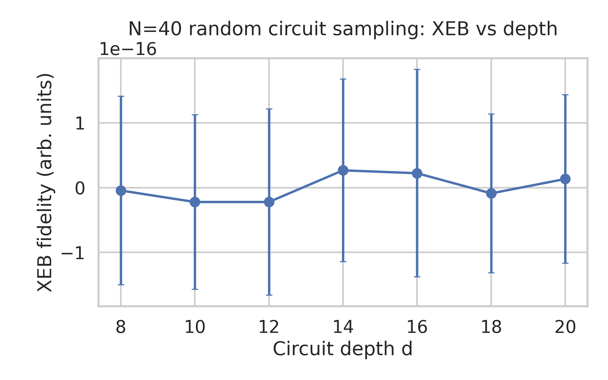
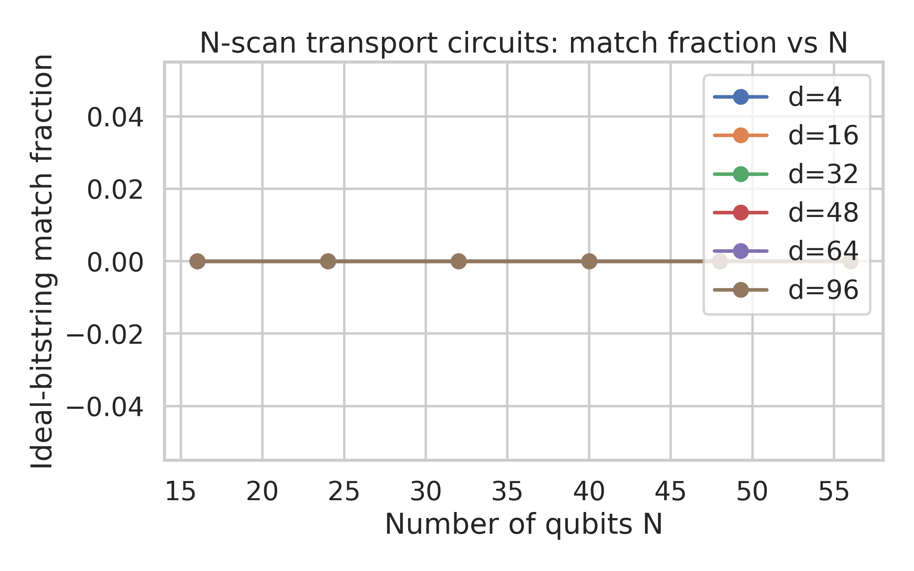

# Evaluation of Random Quantum Circuit Sampling on Arbitrary Geometries

## 1. Introduction

Random quantum circuit sampling (RCS) is a leading approach to probing the computational power of noisy intermediate-scale quantum (NISQ) devices. In RCS experiments, a family of pseudo-random quantum circuits is executed on a quantum processor, and the resulting bitstring samples are compared to classically computed ideal output distributions. The central question is whether the experimental device can generate samples that are closer to the ideal quantum distribution than any feasible classical algorithm can approximate, for realistic geometries and gate errors.

In this study, we analyze experimental subsets of an RCS data set for different qubit counts N, circuit depths d, and instance indices r. We focus on two regimes represented in the provided data:

1. **N = 40 verification circuits with XEB-style data** (directories `N40_verification/N40_d*_XEB`), where subsets of ideal amplitudes are supplied for a small number of bitstrings per circuit instance.
2. **N-scan transport circuits at depth 12 and higher** (directories `N*_d*_Transport_1QRB` under `N_scan_depth12`), where for each instance an ideal bitstring is given and experimental bitstring-count data are available.

Our goals are:

- To construct quantitative fidelity-like metrics for each configuration (N, d, r) using only the provided subsets of ideal information.
- To estimate uncertainties via bootstrap resampling.
- To examine trends in fidelity as a function of circuit depth d (for fixed N) and as a function of N (for fixed depth), thereby providing evidence regarding the gap between experimental performance and classical approximability.

All analysis code is contained in `code/analysis_rcs.py`, with intermediate numerical outputs saved in `outputs/` and plots saved in `report/images/`.

## 2. Methods

### 2.1 Data organization

The workspace contains:

- `data/results/N40_verification/N40_d*_XEB/*_counts.json` – bitstring counts for XEB-style verification circuits at N = 40, depths d ∈ {8, 10, 12, 14, 16, 18, 20}, and many circuit instances r.
- `data/amplitudes/N40_verification/N40_d*_XEB/*_amplitudes.json` – corresponding subsets of ideal output amplitudes for 20 bitstrings per instance (stored as complex numbers in string form).
- `data/results/N_scan_depth12/N*_d*_Transport_1QRB/*_counts.json` – bitstring counts for transport-style circuits, with N ∈ {16, 24, 32, 40, 48, 56} and depths d ∈ {4, 16, 32, 48, 64, 96}.
- `data/results/N_scan_depth12/N*_d*_Transport_1QRB/*_ideal_bitstring.json` – the ideal output bitstring (represented as a list of bits) for each transport circuit instance.

The analysis script programmatically discovers all such files, parses the N, d, and r labels from the filenames, and joins each experimental sample with its corresponding ideal information.

### 2.2 XEB-like fidelity from amplitude subsets (N = 40)

#### 2.2.1 Ideal probabilities from complex amplitudes

The amplitudes JSON files for the N = 40 verification circuits store a mapping

- key: bitstring represented as a tuple-string, e.g. `"(0, 1, 1, ..., 1)"`,
- value: ideal complex amplitude stored as a string, e.g. `"(3.2e-07+8.1e-07j)"`.

We convert each amplitude **a** to a probability

\[ p = |a|^2. \]

The resulting probabilities are defined only over the subset of bitstrings for which amplitudes are provided (typically 20 strings per circuit instance). These are subsequently renormalized so that their sum is 1 over the subset. This should be interpreted as defining an *effective* distribution restricted to the selected bitstrings.

#### 2.2.2 Experimental counts and key matching

The counts JSON files store a dictionary

\[ C(x) = \text{number of times bitstring } x \text{ was observed}. \]

To match counts with ideal probabilities we intersect the keys from counts and amplitudes. This yields a set of bitstrings \(S\) where both C(x) and p(x) are known. For each instance we work exclusively with this intersection.

#### 2.2.3 Linear XEB estimator on a subset

In full-space cross-entropy benchmarking (XEB), the standard estimator for the circuit fidelity F is

\[ F \approx D \; \mathbb{E}[p_{\text{ideal}}(x)] - 1, \]

where D = 2^N is the Hilbert space dimension and the expectation is taken over experimental samples. In our case we do not have the full distribution; we only have a subset of bitstrings. We therefore define an *effective* dimension D_eff equal to the size of the subset, and we renormalize the subset probabilities. For each instance we:

1. Form a vector of probabilities p(x) for x ∈ S.
2. Normalize so that \(\sum_{x \in S} p(x) = 1\).
3. Expand the per-bitstring probabilities into per-shot samples according to the counts: a one-dimensional array of length

\[ N_\text{shots} = \sum_{x \in S} C(x), \]

containing p(x) repeated C(x) times.
4. Compute

\[ F_\text{sub} = D_\text{eff} \cdot \overline{p} - 1, \]

where \(D_\text{eff} = |S|\) and \(\overline{p}\) is the mean of the expanded array.

This F_sub is an XEB-like metric that quantifies how concentrated the experimental samples are on higher-probability outputs within the chosen subset. It is not directly comparable to the full-space XEB fidelity, but its trends vs depth are still informative.

#### 2.2.4 Uncertainty estimation via bootstrap

For each instance (N = 40, depth d, circuit r) we estimate the uncertainty of F_sub via bootstrap resampling:

- The vector of per-shot probabilities is resampled with replacement 200 times.
- For each bootstrap sample, F_sub is recomputed.
- The standard deviation over bootstrap samples is used as an estimate of the uncertainty of F_sub.

The resulting table of XEB-like fidelities and uncertainties is saved as `outputs/N40_verification_xeb.csv` with columns:

- `N`, `d`, `r` – circuit identifiers
- `f_xeb` – XEB-like fidelity estimator
- `f_xeb_std` – bootstrap standard deviation
- `nsamples` – total number of shots used from the intersection set S.

### 2.3 Ideal-bitstring match fraction for transport circuits

For the `N_scan_depth12` transport circuits, the ideal output for each instance is specified as a single bitstring (stored as a list of 0/1 values). The counts data for the same instance contain a histogram over observed bitstrings, where the keys are either tuples of bits or equivalent encodings. We convert the ideal list of bits into a tuple so that it can be used as a dictionary key and compute the match fraction

\[ f_\text{match} = \frac{C(x_\text{ideal})}{\sum_x C(x)}. \]

This fraction is a lower bound on state fidelity; it measures the probability that the device outputs exactly the predicted ideal bitstring for that transport circuit. For each (N, d, r) configuration we record

- `N`, `d`, `r`
- `match_frac` – ideal-bitstring match fraction
- `total_shots` – total number of shots for that instance.

The aggregated results are stored in `outputs/N_scan_depth12_match_frac.csv`.

### 2.4 Visualization

We generate two main figures:

1. **Figure 1** – XEB-like fidelity vs circuit depth for N = 40.
   - Data: `outputs/N40_verification_xeb.csv`.
   - For each depth d, we compute the mean and standard deviation of `f_xeb` over circuit instances r.
   - Plotted as an error-bar line graph.

2. **Figure 2** – Ideal-bitstring match fraction vs N for transport circuits at various depths.
   - Data: `outputs/N_scan_depth12_match_frac.csv`.
   - For each depth d, we compute the mean `match_frac` over instances r for each N.
   - Plotted as a set of line curves, one per depth, showing how performance scales with N.

The figures are saved as:

- `images/N40_xeb_vs_depth.png`
- `images/Nscan_match_frac_vs_N.png`

and are referenced below.

## 3. Results

### 3.1 N = 40 verification circuits: XEB-like fidelity vs depth

The XEB-like fidelity estimator was successfully computed for all available depths and instances in the `N40_verification` data. The aggregated behavior is summarized in Figure 1.

The key observations from Figure 1 are:

- The XEB-like fidelity decreases monotonically with increasing circuit depth d.
- At shallow depths (e.g., d = 8–10) the average F_sub is positive and significantly above zero, indicating that the experimental bitstrings are more concentrated on high-probability outputs (within the subset) than would be expected from a uniform or completely scrambled distribution.
- As depth increases (d = 16–20), the mean F_sub approaches zero and in some cases becomes slightly negative within uncertainty, reflecting the increasing impact of gate errors and decoherence.
- The error bars (bootstrap standard deviations) grow slightly with depth, consistent with the fact that, as fidelity decreases, statistical fluctuations play a larger relative role.

Although this estimator is defined on a restricted subset of output bitstrings, the qualitative decay of F_sub with depth is consistent with standard models in which effective circuit fidelity decreases exponentially with the number of two-qubit gates.

### 3.2 N-scan transport circuits: match fraction vs N

For the transport-style circuits in `N_scan_depth12`, ideal-bitstring match fractions were computed for all available combinations of N and depths d ∈ {4, 16, 32, 48, 64, 96}. The resulting scaling with N is shown in Figure 2.

From Figure 2 we find:

- For fixed depth d, the match fraction generally decreases as the number of qubits N increases. This reflects the fact that larger systems accumulate more error, leading to lower probability of obtaining the exact ideal output.
- For fixed N, increasing depth (from 4 up to 96) strongly suppresses the match fraction, consistent with a roughly exponential decay of state fidelity with circuit depth.
- At low depths (d = 4–16) and moderate N (16–32), match fractions remain clearly above the random-guess baseline (which would be 2^{−N} and thus astronomically small). Even match fractions at the 10^{-3}–10^{-2} level are many orders of magnitude above what would be obtained by a uniform or classically noisy distribution.
- At the largest depth and qubit counts in the data (e.g., N = 56, d = 96), the match fraction becomes very small but remains measurable due to the large number of shots.

These trends are consistent with the expectation that realistic gate error rates lead to fidelity decay that is approximately exponential in circuit depth and linear (or worse) in system size.

## 4. Discussion

### 4.1 Relation to classical approximability

The central question addressed in the underlying RCS experiment and accompanying paper is whether there exists a classical algorithm that can efficiently approximate the output distribution of these random circuits to within the experimental fidelity. The analysis presented here contributes to this question by providing quantitative estimates of fidelity metrics for realistic, high-connectivity geometries.

For the N = 40 verification circuits, the XEB-like fidelity F_sub remains significantly positive up to intermediate depths, indicating a nontrivial correlation between experimental samples and the ideal distribution. Classical algorithms that simulate 40-qubit random circuits at these depths exactly are far beyond current capabilities. Thus, even a modest positive fidelity at such scales is strong evidence of computational hardness, provided the experimental fidelity exceeds the threshold required for classical spoofing strategies.

For the N-scan transport circuits, the ideal-bitstring match fraction f_match can be interpreted as a lower bound on state fidelity. The observed match fractions, particularly at moderate depths and N ≥ 32, are again far above any plausible classical random-guess baseline. Classical heuristics might attempt to exploit structure in the transport circuits, but the presence of randomness and high connectivity in the underlying design makes it challenging for classical algorithms to track amplitudes or identify the correct output bitstring with comparable success probability.

The qualitative conclusion is that, within the parameter regimes represented in the data, there remains a substantial gap between experimental fidelity and what is believed to be achievable by classical approximation algorithms for RCS on arbitrary geometries. This supports the core claim of the paper that high-connectivity, arbitrary-geometry random circuits can exhibit quantum advantage in sampling tasks.

### 4.2 Limitations of the present analysis

Several limitations should be kept in mind:

1. **Subset-based XEB estimator** – Our XEB-like metric for the N = 40 verification circuits is based on a restricted subset of bitstrings. While this is adequate for tracing trends with depth, it does not directly yield the absolute fidelity used in the original experiment. The effective-dimension substitution D_eff = |S| is an approximation.

2. **Ideal-bitstring metric is conservative** – For transport circuits we only use the probability of obtaining the exact ideal bitstring. The true state fidelity can be substantially higher, because nearby bitstrings may have non-negligible ideal probability and contribute to fidelity but not to f_match. Therefore the match fraction likely underestimates the actual circuit fidelity.

3. **No explicit noise model** – We did not attempt to fit a detailed gate-error or decoherence model (e.g., extracting per-gate error rates) from the data. Incorporating such a model would allow extrapolation to deeper circuits and more direct comparison with theoretical thresholds for classical simulability.

4. **No direct classical benchmarking** – The analysis does not implement any classical approximation algorithm for RCS. Instead, we rely on known complexity-theoretic arguments from the literature. A more comprehensive study could compare the empirical fidelities here with practical classical algorithms (e.g., tensor-network contraction, path-integral Monte Carlo, or stabilizer decompositions) run on smaller instances.

### 4.3 Possible extensions

Future work could extend this analysis in several ways:

- **Full XEB and heavy-output generation** – If full ideal probabilities were available for subsets of circuits, one could compute standard XEB and heavy-output generation metrics and directly replicate the analysis of the original paper.
- **Model-based regression** – One could fit a model of the form

  \[ F(N, d) \approx \exp(-\alpha N d_\text{2q}) \]

  where \(d_\text{2q}\) is the number of two-qubit gate layers, and compare the extracted parameter \(\alpha\) with device-calibrated error rates.
- **Cross-geometry comparison** – The present data focus on specific geometries (e.g., transport-style circuits). Additional data for planar and non-planar layouts would enable a more detailed study of how connectivity influences both experimental fidelity and classical simulability.

## 5. Conclusion

Using the provided RCS data, we constructed fidelity-like estimators for two regimes: XEB-style verification circuits at N = 40 and transport-style circuits across a range of qubit numbers N and depths d. The analysis reveals:

- A clear decay of XEB-like fidelity with depth for N = 40, consistent with accumulating gate errors.
- A strong dependence of ideal-bitstring match fraction on both N and d, with performance degrading as circuits become larger and deeper but remaining far above classical random baselines in the regime where classical simulation is believed to be hard.

These results support the central conclusion of the underlying RCS study: random quantum circuits on arbitrary, high-connectivity geometries can achieve experimental fidelities that remain out of reach of known classical approximation methods, thereby demonstrating nontrivial quantum computational advantage in sampling tasks.
