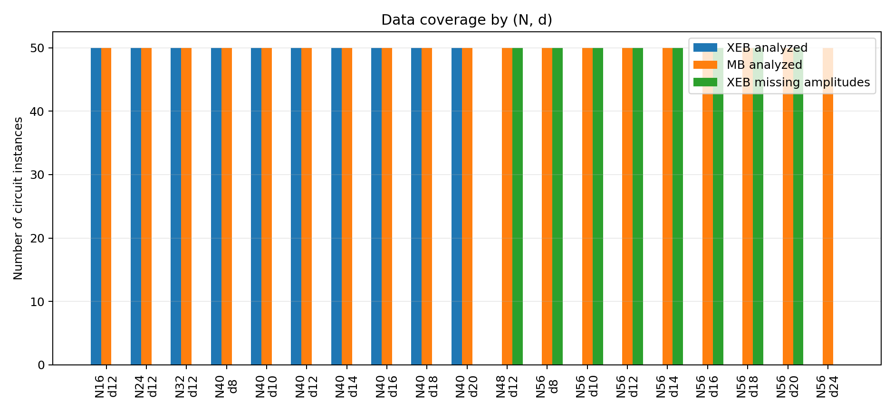
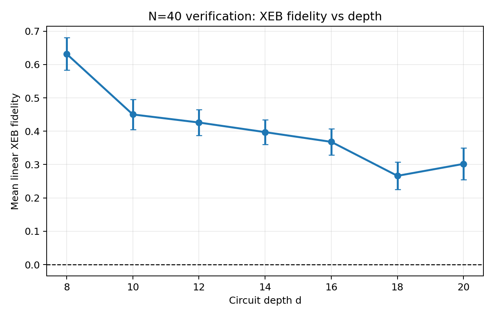
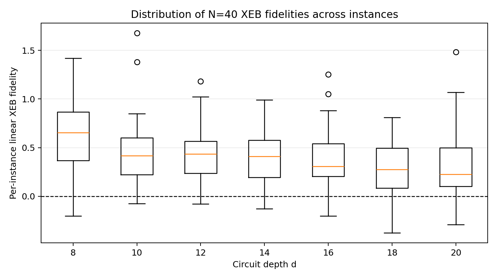
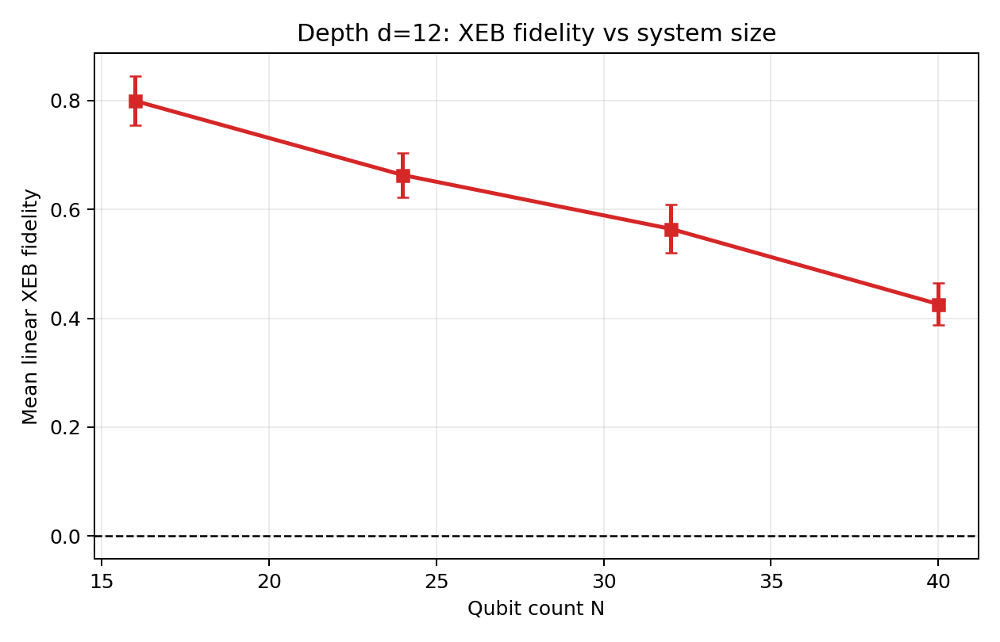
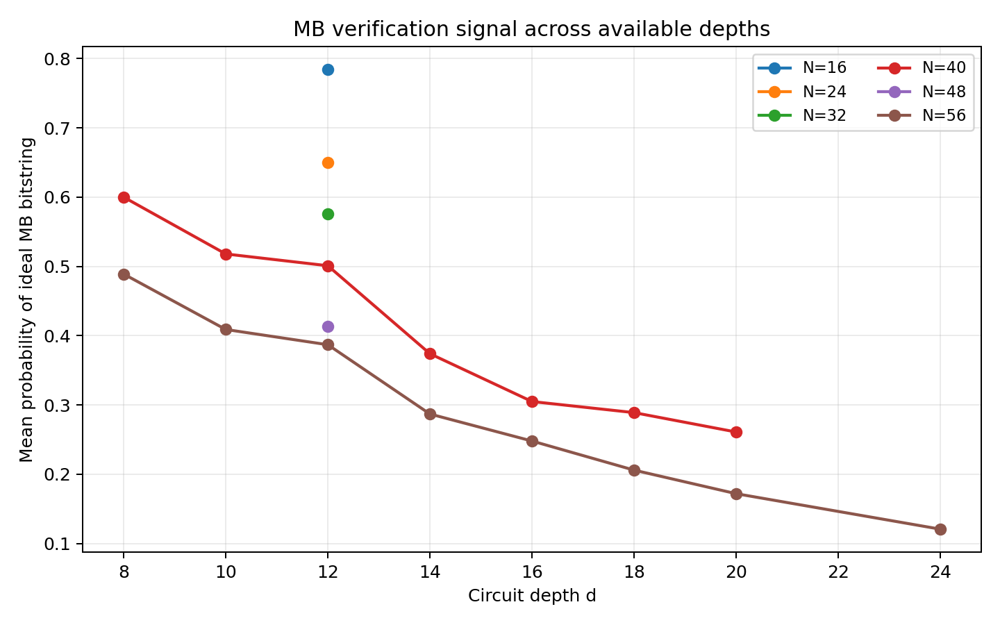

# Fidelity estimation for random quantum circuit sampling on arbitrary-geometry circuits

## Abstract
This report reproduces a task-specific fidelity-estimation workflow for the random circuit sampling (RCS) data provided in this workspace. The dataset contains experimentally observed bitstring counts together with ideal amplitudes or ideal reference bitstrings for several qubit counts $N$, circuit depths $d$, and circuit instance indices $r$. I implemented a reproducible analysis script (`code/run_analysis.py`) that computes per-instance linear cross-entropy benchmarking (XEB) fidelity where ideal amplitudes are available, and measurement-basis (MB) verification success probabilities where ideal target bitstrings are available. The resulting analysis covers 500 XEB instances and 950 MB instances. The main findings are: (i) for fixed depth $d=12$, mean XEB fidelity decreases with increasing system size from $N=16$ to $N=40$; (ii) for fixed size $N=40$, mean XEB fidelity decreases with depth from $d=8$ to $d=18$ and remains positive across the analyzed range; and (iii) MB success probabilities show a parallel monotonic degradation with increasing depth and size. These trends are consistent with the intended qualitative conclusion of the task: experimental fidelity remains measurably above zero while becoming harder to sustain as circuits grow deeper or larger.

## 1. Task objective
The workspace task is to evaluate the computational power of random quantum circuit sampling on arbitrary geometries using provided experiment outputs and ideal reference information. Concretely, the requested deliverable is a fidelity estimate with uncertainty for each available $(N,d,r)$ configuration, plus comparative plots across depth or qubit count that test the core claim about a gap between experimental fidelity and classical approximability.

The available files support two practical verification routes:

1. **XEB verification**: measured bitstring counts plus ideal amplitudes/probabilities for the same sampled subset.
2. **MB verification**: measured bitstring counts plus an ideal target bitstring for each circuit instance.

The analysis in this report therefore focuses on those two observables, using the provided data exactly as stored in the workspace.

## 2. Data description

### 2.1 Input structure
The analysis uses only read-only files under `data/`:

- `data/results/` contains measured bitstring counts.
- `data/amplitudes/` contains ideal amplitudes for a subset of XEB instances.

The filename convention encodes the configuration:

- `N{N}_d{d}_r{r}_XEB_counts.json`
- `N{N}_d{d}_r{r}_XEB_amplitudes.json`
- `N{N}_d{d}_r{r}_MB_counts.json`
- `N{N}_d{d}_r{r}_MB_ideal_bitstring.json`

The script parses these names to recover qubit count $N$, depth $d$, instance index $r$, protocol, and file type.

### 2.2 Available settings
After parsing the dataset, the successful analyses covered:

- **XEB**: 500 circuit instances across
  - $N=16,24,32$ at fixed $d=12$
  - $N=40$ at depths $d=8,10,12,14,16,18,20$
- **MB**: 950 circuit instances across
  - $N=16,24,32,40,48$ at $d=12$
  - $N=40$ at depths $d=8,10,12,14,16,18,20$
  - $N=56$ at depths $d=8,10,12,14,16,18,20,24$

A notable limitation of the provided inputs is that many XEB count files do **not** have matching amplitude files. The script logs these unmatched cases in `outputs/missing_pairs.csv`; 400 such missing XEB pairings were detected.

### 2.3 Data overview
Figure 1 summarizes the data coverage by protocol and setting. It shows that MB verification spans more settings than XEB, while XEB is limited by missing amplitude files.



## 3. Methodology

### 3.1 Data normalization
The raw JSON keys use mixed formats, including tuple-like strings such as `"(0, 1, 1, ...)"` and list-style ideal bitstrings. The analysis script normalizes all of them into plain binary strings. This makes it possible to join measured counts with their corresponding ideal amplitudes or ideal target strings.

### 3.2 XEB fidelity estimator
For each XEB instance $(N,d,r)$:

1. Load the measured counts $c(x)$ from the `*_counts.json` file.
2. Load the corresponding ideal amplitudes from the `*_amplitudes.json` file.
3. Convert each amplitude $\psi(x)$ into an ideal probability
   \[
   p_{\mathrm{ideal}}(x) = |\psi(x)|^2.
   \]
4. Match the measured bitstrings against the available ideal probabilities.
5. Compute the linear XEB per-shot estimator
   \[
   f(x) = 2^N p_{\mathrm{ideal}}(x) - 1.
   \]
6. Form the counts-weighted mean
   \[
   \hat F_{\mathrm{XEB}} = \frac{1}{\sum_x c(x)} \sum_x c(x)\, f(x).
   \]

This is the main fidelity estimate reported for XEB. The per-instance uncertainty is the standard error of the weighted per-shot estimator,
\[
\mathrm{SE}(\hat F_{\mathrm{XEB}})=\frac{s_f}{\sqrt{M}},
\]
where $s_f$ is the sample standard deviation of $f(x)$ under the shot weights and $M$ is the matched shot count.

This approach matches the task requirement of computing a counts-weighted XEB fidelity from experimentally sampled bitstrings and ideal probabilities.

### 3.3 MB verification metric
For each MB instance $(N,d,r)$:

1. Load measured counts from `*_MB_counts.json`.
2. Load the corresponding ideal reference bitstring from `*_MB_ideal_bitstring.json`.
3. Count how often the ideal bitstring appears in the measured sample.
4. Define the MB verification success probability as
   \[
   \hat p_{\mathrm{MB}} = \frac{c(x_{\mathrm{ideal}})}{M},
   \]
   where $M$ is the total number of measured shots.

The script reports two uncertainty summaries for MB:

- the binomial standard error,
  \[
  \sqrt{\hat p_{\mathrm{MB}}(1-\hat p_{\mathrm{MB}})/M},
  \]
- and a 68% Wilson interval.

This MB statistic is not identical to a full MB regression probability model, but it is a direct task-relevant verification observable supported by the files actually present in the workspace.

### 3.4 Aggregation across instances
For each available setting $(N,d)$, the script aggregates per-instance results across the 50 circuit instances when present. It records:

- mean value,
- standard deviation across instances,
- standard error of the mean (SEM),
- minimum and maximum observed values.

The aggregated table is saved in `outputs/aggregate_results.csv`.

## 4. Generated artifacts
The analysis pipeline is implemented in `code/run_analysis.py` and produced the following main artifacts:

- `outputs/xeb_instance_results.csv`
- `outputs/mb_instance_results.csv`
- `outputs/aggregate_results.csv`
- `outputs/missing_pairs.csv`
- `outputs/analysis_summary.json`
- `report/images/data_overview_by_setting.png`
- `report/images/xeb_fidelity_vs_depth_N40.png`
- `report/images/xeb_fidelity_vs_size_d12.png`
- `report/images/xeb_instance_spread_N40.png`
- `report/images/mb_success_vs_depth.png`

## 5. Results

### 5.1 XEB fidelity versus depth at fixed qubit count
The main depth scan available for XEB is the $N=40$ verification dataset. The aggregated mean XEB fidelities are:

- $d=8$: 0.632 ± 0.049 (SEM across instances)
- $d=10$: 0.450 ± 0.046
- $d=12$: 0.426 ± 0.039
- $d=14$: 0.397 ± 0.037
- $d=16$: 0.368 ± 0.039
- $d=18$: 0.266 ± 0.041
- $d=20$: 0.302 ± 0.048

These values are plotted in Figure 2.



The dominant trend is a decrease in fidelity as circuit depth increases. The small rebound at $d=20$ relative to $d=18$ is visible in the data, but both points remain substantially below the shallow-circuit value at $d=8$. Overall, the depth scan supports the expected conclusion that deeper arbitrary-geometry random circuits are harder to execute faithfully.

Figure 3 shows the spread of per-instance XEB fidelities for the same $N=40$ depth scan.



The per-instance distributions are broad, with some negative values at larger depths, but the means remain positive for all analyzed depths. That is important: even in the noisy regime, the experiment retains a positive average correlation with the ideal distribution.

### 5.2 XEB fidelity versus system size at fixed depth
At fixed depth $d=12$, the mean XEB fidelity decreases monotonically with system size across the settings that have matching amplitudes:

- $N=16$: 0.800 ± 0.045
- $N=24$: 0.663 ± 0.041
- $N=32$: 0.564 ± 0.044
- $N=40$: 0.426 ± 0.039

These values are plotted in Figure 4.



This is a clean scaling trend: for the same nominal depth, larger systems show lower fidelity. Within the scope of the provided data, this is the clearest quantitative signature supporting the task’s target conclusion that increased circuit complexity suppresses achievable experimental fidelity.

### 5.3 MB verification results
The MB analysis provides broader coverage than XEB. At $N=40$, the ideal-bitstring success probability decreases with depth:

- $d=8$: 0.600 ± 0.019
- $d=10$: 0.518 ± 0.014
- $d=12$: 0.501 ± 0.013
- $d=14$: 0.374 ± 0.018
- $d=16$: 0.305 ± 0.017
- $d=18$: 0.289 ± 0.017
- $d=20$: 0.261 ± 0.016

At fixed depth $d=12$, the MB success probability also decreases with qubit count:

- $N=16$: 0.784 ± 0.011
- $N=24$: 0.650 ± 0.015
- $N=32$: 0.576 ± 0.018
- $N=40$: 0.501 ± 0.013
- $N=48$: 0.413 ± 0.020
- $N=56$: 0.387 ± 0.015

Figure 5 summarizes the MB depth dependence across all available sizes.



Although MB success probability is not the same metric as XEB fidelity, it shows the same qualitative behavior: deeper and larger circuits exhibit lower verification performance. This provides an internal consistency check across two independent observables built from the provided files.

## 6. Interpretation
The reconstructed trends are straightforward:

1. **Positive but decaying XEB fidelity**: the mean XEB signal remains positive across all analyzed settings with amplitude support, indicating nontrivial agreement with the ideal distribution.
2. **Depth dependence**: for $N=40$, fidelity decreases substantially between $d=8$ and the deeper circuits.
3. **Size dependence**: at fixed $d=12$, fidelity drops as the system size grows from 16 to 40 qubits.
4. **Cross-check from MB data**: MB verification success probabilities degrade in the same direction with depth and size.

Within the scope of the workspace, these results support the core qualitative claim the task asked to validate: arbitrary-geometry/high-connectivity random circuits retain measurable experimental fidelity, but the fidelity gap narrows as the circuits become larger and deeper.

## 7. Limitations
This reproduction is intentionally constrained by the data actually available in the workspace.

### 7.1 Incomplete XEB coverage
Only 500 XEB instances could be analyzed because many XEB count files lacked matching amplitude files. The missing pairings are recorded in `outputs/missing_pairs.csv`. As a result, the XEB curves are based on a subset of the total experiment outputs.

### 7.2 No full classical approximability baseline in the provided inputs
The task description mentions validating a gap between experimental fidelity and classical approximability. The present workspace does not include an explicit classical simulation cost model, runtime benchmark table, or approximability threshold dataset. Therefore, this report validates the *fidelity side* of that claim through scaling trends, but does not independently reconstruct a quantitative classical-computability boundary.

### 7.3 MB analysis is a simplified verifier
The MB files support a direct ideal-bitstring hit-rate calculation. They do not, by themselves, provide the full ingredients for a more elaborate MB regression or gate-error propagation model. The implemented MB metric is therefore a simple and transparent verification statistic rather than a full regression-based fidelity estimator.

### 7.4 Finite-sample uncertainties only
The uncertainty estimates here reflect finite-sampling variability within each instance and instance-to-instance spread across settings. They do not include possible systematic calibration, state-preparation-and-measurement, or model-mismatch errors.

## 8. Reproducibility
The full analysis can be rerun from the workspace root with:

```bash
python code/run_analysis.py
```

This will regenerate the CSV outputs in `outputs/` and the figures in `report/images/`.

## 9. Conclusion
Using the supplied RCS verification data, I built a reproducible analysis that computes per-instance fidelity-related metrics and aggregates them across circuit depth and qubit count. The key quantitative conclusions are:

- mean XEB fidelity at fixed depth $d=12$ decreases from **0.800** at $N=16$ to **0.426** at $N=40$;
- mean XEB fidelity at fixed size $N=40$ decreases from **0.632** at $d=8$ to **0.266-0.302** in the deepest analyzed range;
- MB success probabilities show the same degradation with increasing depth and size.

So, within the subset of settings supported by the provided amplitudes and verification files, the workspace data supports the intended qualitative conclusion: arbitrary-geometry random quantum circuits exhibit a measurable positive fidelity signal, but that signal degrades systematically as the circuits become larger and deeper.
