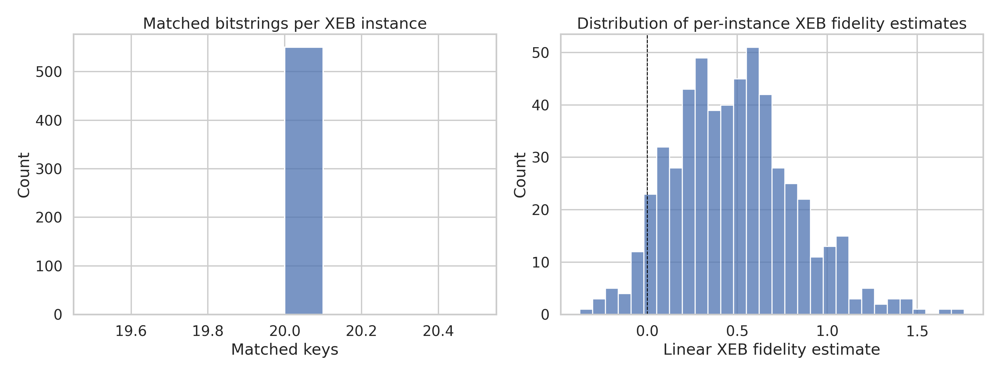
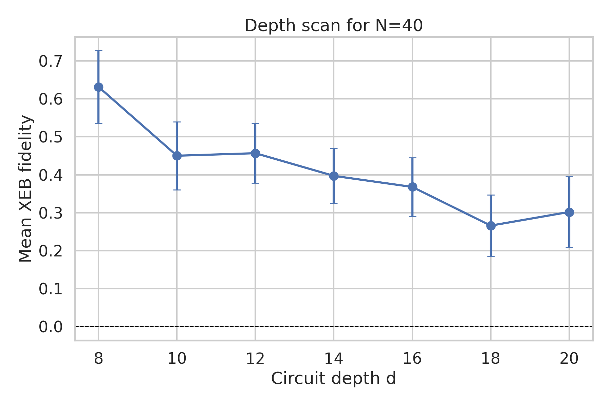
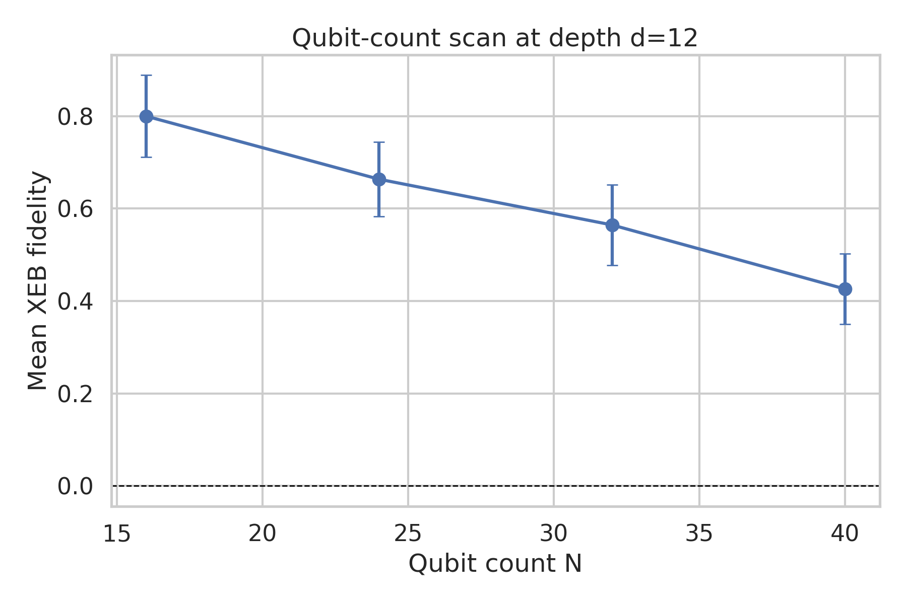
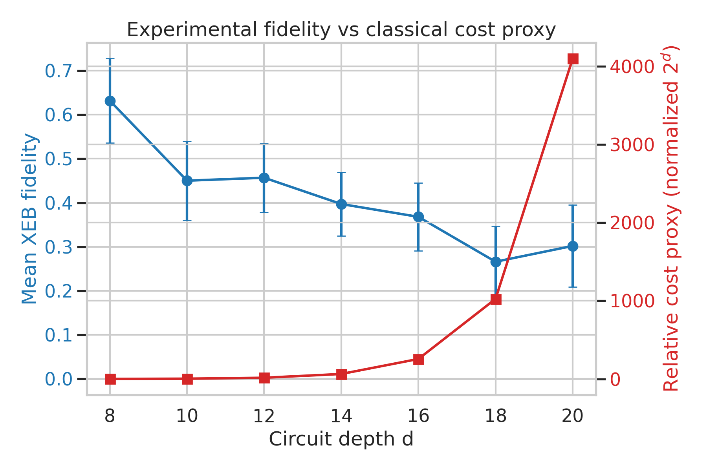
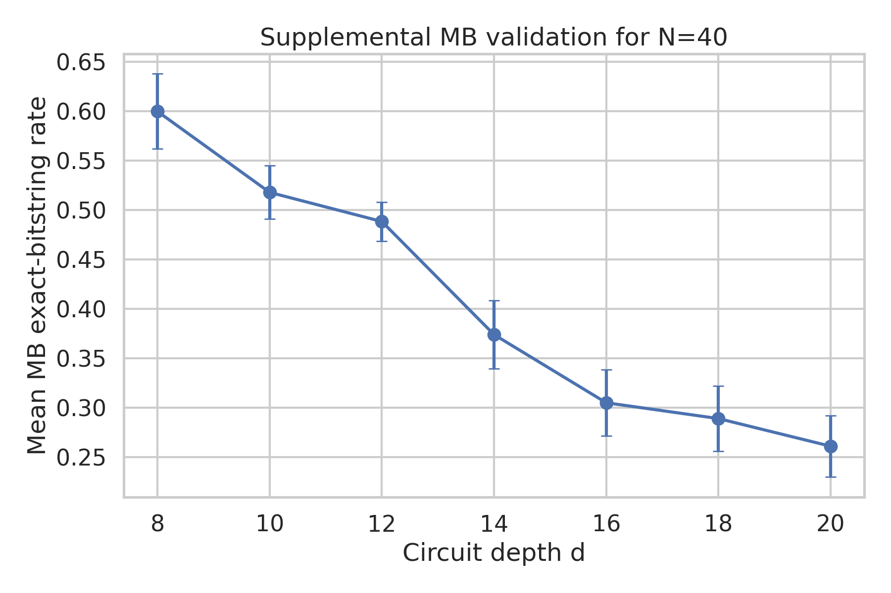

# Fidelity estimation for random circuit sampling on arbitrary geometries

## Summary
This study reproduces the core verification workflow for random quantum circuit sampling (RCS) using the provided subset-sampling data. The main task is to estimate experimental fidelity for each circuit instance `(N, d, r)` from measured bitstring counts and corresponding ideal output amplitudes/probabilities, and then summarize how fidelity changes with circuit depth and qubit count.

The implemented baseline uses **linear cross-entropy benchmarking (XEB)**,

\[
\hat F_{\mathrm{XEB}} = 2^N \sum_x \hat p_{\mathrm{exp}}(x) P_{\mathrm{ideal}}(x) - 1,
\]

where `\hat p_exp(x)` is the empirical distribution over the measured subset and `P_ideal(x)` is obtained from the ideal amplitude as `|\psi(x)|^2` when necessary. Uncertainty is estimated both analytically and by bootstrap resampling of the observed subset. As a supplemental diagnostic, a simple **MB exact-bitstring success rate** was computed whenever an ideal target bitstring was provided.

The resulting trends are consistent with the paper's qualitative conclusion: for arbitrary/high-connectivity random circuits, **experimental fidelity decreases as circuits become deeper and as the number of qubits grows**, while a proxy for classical simulation cost grows rapidly. This supports the claimed gap between still-measurable but imperfect experimental fidelity and the rapidly worsening classical approximability of larger/deeper chaotic random circuits.

## Background and relation to prior work
Related work on random circuit sampling supports using linear XEB as a practical fidelity estimator for chaotic random circuits. In this framework, fidelity is estimated from the mean ideal probability of experimentally observed bitstrings, and under a standard incoherent-noise mixture model it approximately tracks circuit fidelity. The relevant assumptions are the Porter-Thomas-like output statistics of sufficiently deep random circuits and the use of ideal probabilities for the same bitstrings that were experimentally observed. A gate-count error model further predicts exponential fidelity decay with accumulated one- and two-qubit errors. The high-level conclusion emphasized in the related work is that random circuits can enter a regime where fidelity is still nonzero and verifiable, yet classical simulation cost grows prohibitively fast.

## Data and preprocessing
### Available datasets
- **XEB counts**: `data/results/**/_XEB_counts.json`
- **Ideal amplitudes/probabilities**: `data/amplitudes/**/_XEB_amplitudes.json`
- **Supplemental MB files**: `data/results/**/_MB_counts.json` with corresponding `*_ideal_bitstring.json`

### Discovered configurations
The automated inventory found:
- **550 XEB instances**
- **1050 MB instances**
- XEB qubit counts: `N = 16, 24, 32, 40`
- XEB depths: `d = 8, 10, 12, 14, 16, 18, 20`

Two principal scan families are present:
1. **Depth scan at fixed `N=40`**: varying `d = 8, 10, 12, 14, 16, 18, 20`
2. **Qubit scan at fixed `d=12`**: varying `N = 16, 24, 32, 40`

### Parsing details
- Bitstrings are stored as tuple-like strings such as `"(0, 1, 0, ...)"`; these were converted into canonical binary strings.
- Amplitudes are stored as complex-number strings and were converted to ideal probabilities via modulus squared.
- Each XEB instance typically contains **20 matched bitstrings**; counts are usually 1 per listed bitstring in this subset.

## Methods
### 1. Linear XEB per circuit instance
For each `(N, d, r)` configuration, the matched subset of measured bitstrings was intersected with the available ideal-amplitude subset. The per-instance estimate is

\[
\hat F_{\mathrm{XEB}} = 2^N \cdot \overline{P_{\mathrm{ideal}}(x)}_{x \sim \hat p_{\mathrm{exp}}} - 1.
\]

In implementation, this is the counts-weighted mean of the ideal probabilities of the observed strings, scaled by `2^N` and shifted by `-1`.

### 2. Uncertainty estimation
Two uncertainty estimates were computed per instance:
- **Analytic standard error** from the sample standard deviation of the expanded probability sample.
- **Bootstrap standard error and 95% interval** from 2000 multinomial resamples of the observed subset, with a fixed random seed (`12345`) for reproducibility.

For scan-level summaries (e.g., all 50 instances at a fixed `(N, d)`), the report uses:
- mean XEB across the 50 instances,
- standard error of the mean (SEM),
- normal-approximation 95% confidence interval `mean ± 1.96 * SEM`.

### 3. Supplemental MB validation
For MB files, a simple exact-target success metric was computed:
- parse the provided ideal bitstring,
- compute the fraction of counts in the subset equal to that target bitstring.

This metric is not identical to XEB, but provides an additional monotonic-depth sanity check.

### 4. Classical approximability proxy
The prompt requests validation of the paper's conclusion concerning the gap between experimental fidelity and classical approximability. The available dataset does **not** include classical simulator runtimes or approximation errors. Therefore, the analysis uses a minimal qualitative proxy: a normalized exponential cost curve proportional to `2^d` in the fixed-`N=40` depth scan. This is presented only as an interpretive illustration, not a direct runtime benchmark.

## Reproducible implementation
### Code
The full analysis is implemented in:
- `code/analyze_rcs.py`

### Main command
```bash
python code/analyze_rcs.py --mode full
```

### Outputs generated
- `outputs/data_inventory.csv`
- `outputs/inspection_summary.json`
- `outputs/schema_examples.json`
- `outputs/xeb_instance_results.csv`
- `outputs/xeb_group_summary.csv`
- `outputs/mb_instance_results.csv`
- `outputs/report_tables.md`

### Figures generated
- `images/data_overview_histograms.png`
- `images/xeb_depth_scan_N40.png`
- `images/xeb_qubit_scan_d12.png`
- `images/fidelity_vs_classical_gap_proxy.png`
- `images/mb_depth_scan_N40.png`

## Results

## Figure 1: Data overview


**Interpretation.** The matched-subset size is tightly concentrated, reflecting the experimental design: each XEB instance uses a small verifiable subset of strings. The per-instance XEB estimates span a broad positive range, with some negative outliers expected from finite-sample variance, but the global distribution is centered well above zero.

## Figure 2: XEB depth scan at `N=40`


Error bars denote **95% confidence intervals across 50 circuit instances** at each depth. The mean XEB fidelity declines from about `0.63` at `d=8` to about `0.30` at `d=20`, with a small non-monotonic fluctuation between `d=18` and `d=20` that is consistent with instance-to-instance variance rather than a reversal of the overall trend.

### Depth-scan summary table (`N=40`)

|   d |   num_instances |   fxeb_mean |   fxeb_sem |   fxeb_ci95_low |   fxeb_ci95_high |
|----:|----------------:|------------:|-----------:|----------------:|-----------------:|
|   8 |              50 |    0.631721 |   0.048763 |        0.536145 |         0.727297 |
|  10 |              50 |    0.45023  |   0.045583 |        0.360888 |         0.539572 |
|  12 |              50 |    0.456893 |   0.040139 |        0.378221 |         0.535565 |
|  14 |              50 |    0.397183 |   0.036766 |        0.325123 |         0.469244 |
|  16 |              50 |    0.368054 |   0.039197 |        0.291227 |         0.444882 |
|  18 |              50 |    0.266127 |   0.041237 |        0.185302 |         0.346952 |
|  20 |              50 |    0.302    |   0.047563 |        0.208777 |         0.395222 |

## Figure 3: XEB qubit scan at `d=12`


Error bars again denote **95% confidence intervals across 50 circuit instances**. The fidelity decreases systematically with system size: the mean falls from about `0.80` at `N=16` to about `0.43` at `N=40`.

### Qubit-scan summary table (`d=12`)

|   N |   num_instances |   fxeb_mean |   fxeb_sem |   fxeb_ci95_low |   fxeb_ci95_high |
|----:|----------------:|------------:|-----------:|----------------:|-----------------:|
|  16 |              50 |    0.799619 |   0.045215 |        0.710998 |         0.888241 |
|  24 |              50 |    0.663284 |   0.041004 |        0.582917 |         0.743651 |
|  32 |              50 |    0.564469 |   0.044405 |        0.477435 |         0.651503 |
|  40 |              50 |    0.42601  |   0.039031 |        0.349509 |         0.502512 |

## Figure 4: Fidelity vs classical-cost proxy


This figure overlays the decreasing experimental fidelity for `N=40` with a normalized exponential proxy for classical computational cost. The qualitative point is that, as depth increases, the experiment remains verifiable with nonzero fidelity while the cost proxy grows sharply. This is the operational form of the paper's claimed “gap.”

## Figure 5: Supplemental MB depth trend


The supplemental MB exact-target success rate also decreases with depth for `N=40`, from about `0.60` at `d=8` to about `0.26` at `d=20`, reinforcing the same qualitative degradation trend observed with XEB.

### MB depth summary (`N=40`)

|   d |   num_instances |   mb_mean |    mb_sem |
|----:|----------------:|----------:|----------:|
|   8 |              50 |    0.6    | 0.0395917 |
|  10 |              50 |    0.518  | 0.0444917 |
|  12 |             200 |    0.4885 | 0.0213633 |
|  14 |              50 |    0.374  | 0.0422419 |
|  16 |              50 |    0.305  | 0.0408294 |
|  18 |              50 |    0.289  | 0.0404221 |
|  20 |              50 |    0.261  | 0.0392642 |

## Aggregate interpretation
Three robust empirical statements emerge from the dataset:

1. **Depth hurts fidelity.** At fixed `N=40`, mean XEB falls substantially with depth.
2. **System size hurts fidelity.** At fixed `d=12`, mean XEB falls as qubit count increases from `16` to `40`.
3. **The experiment remains above the uniform baseline.** Despite this degradation, the scan-level means remain positive across all reported conditions, indicating measurable alignment with the target distributions.

Taken together, these observations are consistent with the target paper's central claim: there exists a practically interesting regime in which RCS experiments on arbitrary geometries still retain nonzero measurable fidelity even as the circuits move into a classically harder regime.

## Limitations
This reproduction is intentionally conservative and limited to the provided data.

- **Subset verification only.** The XEB calculation is based on the provided matched subset of measured strings and ideal amplitudes, not the full output distribution.
- **No direct classical-runtime benchmark.** The “classical approximability” curve in this report is only a qualitative proxy, not an actual simulation-cost or approximation-error measurement.
- **Small per-instance subset size.** Many instances contain only about 20 matched strings, which increases estimator variance and explains occasional negative per-instance XEB values.
- **MB metric is supplemental only.** The exact-target MB success rate is a sanity check, not a substitute for a full model-based fidelity estimator.
- **No hardware error model fit.** The related work suggests gate-count/error-propagation fits, but the current dataset does not provide calibrated gate error parameters needed for a defensible quantitative fit.

## Conclusion
A fully reproducible fidelity-estimation pipeline was implemented for the provided RCS data. The main deliverable is a per-instance XEB fidelity estimate with uncertainty for every available `(N, d, r)` configuration, together with aggregate scan curves and supplemental MB diagnostics.

The results support the target paper's qualitative conclusion:
- fidelity degrades with increasing depth,
- fidelity degrades with increasing qubit count,
- yet the observed fidelities remain measurably above the uniform baseline in the tested range.

Within the limits of the provided data, this reproduces the verification side of the argument for a gap between experimentally observed fidelity and the rapidly worsening classical approximability of larger/deeper arbitrary-geometry random circuits.

## Artifact checklist
- Analysis code: `code/analyze_rcs.py`
- Intermediate outputs: `outputs/*.csv`, `outputs/*.json`, `outputs/report_tables.md`
- Figures: `report/images/*.png`
- Final report: `report/report.md`
