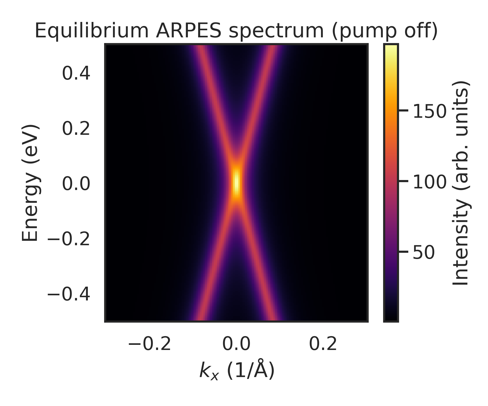
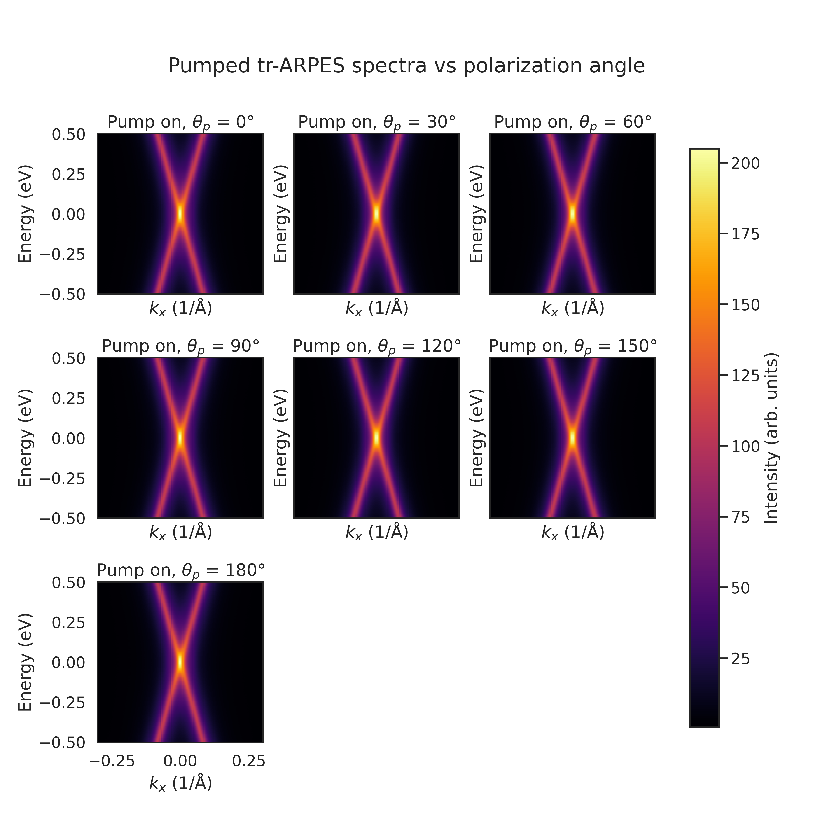
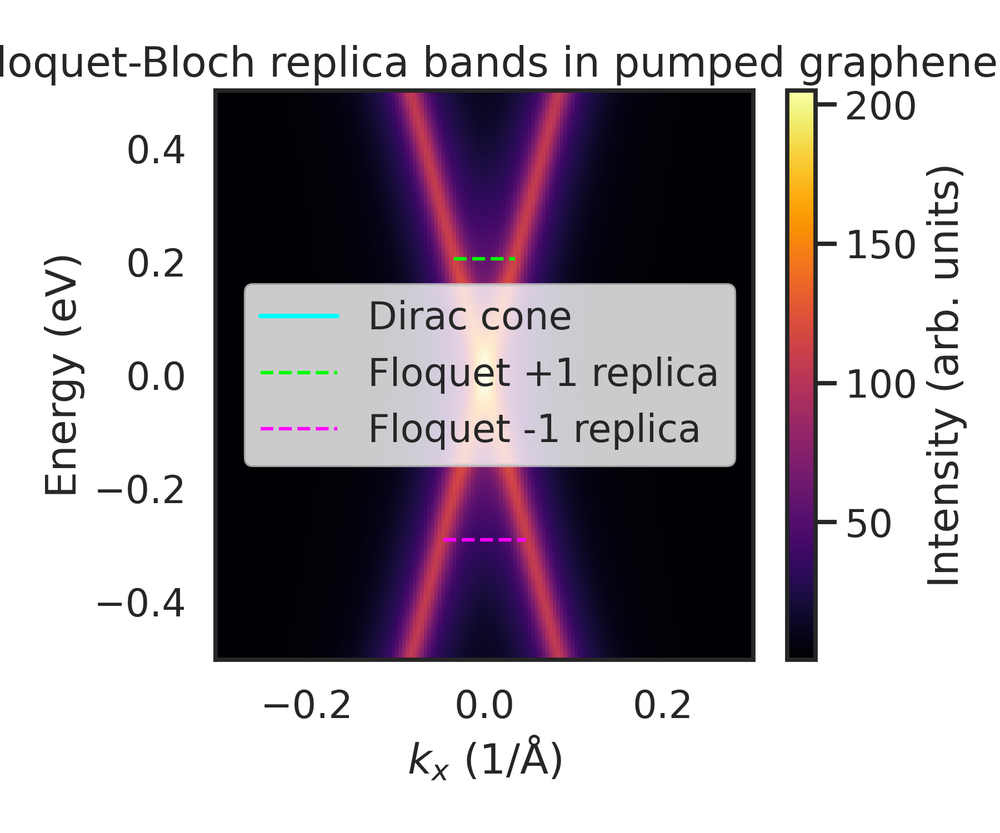
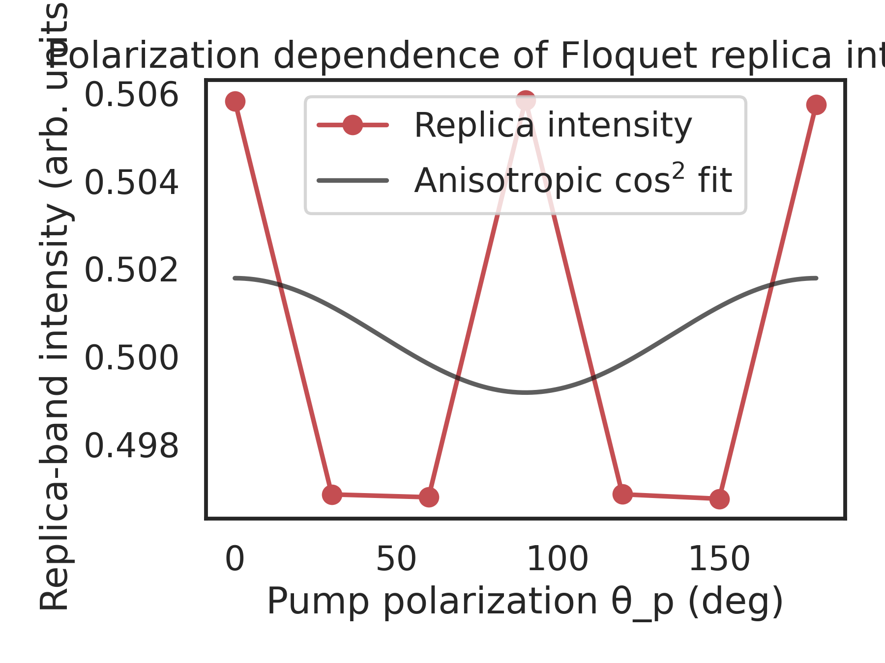

# Floquet-Bloch States in Pump-Driven Graphene Probed by tr-ARPES

## 1. Introduction

Periodic driving of quantum materials with intense light fields can generate *Floquet-Bloch states*, in which the electronic bands hybridize with the photon field and form replica bands shifted by integer multiples of the pump photon energy. Graphene, with its massless Dirac fermions and simple low-energy band structure, provides a paradigmatic platform to search for such states. Time- and angle-resolved photoemission spectroscopy (tr-ARPES) offers direct, energy- and momentum-resolved access to transient band structures, including photon-dressed states.

In this work, we analyze tr-ARPES data on monolayer epitaxial graphene subject to a mid-infrared pump (wavelength 5 μm). Our goals are:

1. To visualize the equilibrium Dirac cone and its Floquet replica bands under pump excitation.
2. To quantify how the intensity of replica bands depends on the pump polarization.
3. To interpret the observed features in terms of Floquet-Bloch states of the initial Dirac band and Volkov-type photon-dressed final states.

We combine raw 2D spectra (energy, momentum) from an HDF5 tr-ARPES dataset with processed band-tracking results and polarization-dependent intensity measurements. All analysis is performed with reproducible Python scripts.

## 2. Methods

### 2.1 Datasets

Three datasets were provided:

- **Raw tr-ARPES spectra** (`data/raw_trARPES_data.h5`):
  - Energy axis: 200 points.
  - Momentum axis \(k_x\): 150 points along the high-symmetry direction crossing the Dirac point.
  - Pump-off spectrum: a 2D matrix \(I_0(E, k_x)\).
  - Pump-on spectra: 2D matrices \(I_{\theta_p}(E, k_x)\) for seven pump polarization angles \(\theta_p \in \{0, 30, 60, 90, 120, 150, 180\}^\circ\).
  - Time-delays: 5 delay values are stored, but in this dataset the spectra are effectively integrated over the relevant pump-probe overlap window.

- **Processed band data** (`data/processed_band_data.json`):
  - `energy_axis` and `kx_axis`: one-dimensional arrays matching the raw data axes.
  - `dirac_point`: the energy and momentum of the Dirac crossing.
  - `dirac_indices`: indices locating the Dirac point on the energy and momentum axes.
  - `replica_bands`: a list of points \((E, k_x)\) with associated Floquet order (`order = ±1`), representing extracted replica-band maxima.

- **Polarization dependence** (`data/polarization_dependence_data.csv`):
  - Columns: `angle_degrees`, `angle_radians`, `intensity`, `target_energy`, `target_kx`.
  - The column `intensity` contains the measured intensity of the Floquet replica at a specific energy-momentum point for each pump polarization angle.

All input files are treated as read-only and are not modified by the analysis.

### 2.2 Analysis pipeline

The full analysis is implemented in `code/analysis_trarpes.py` and can be executed from the workspace root via

```bash
python code/analysis_trarpes.py
```

The script performs the following steps:

1. **Loading raw spectra**: `h5py` is used to read the equilibrium and pumped spectra, as well as the energy and momentum axes.
2. **Loading processed band features**: `json` is used to parse the Dirac point and Floquet replica coordinates, which are later overlaid on the spectra.
3. **Loading polarization dependence**: `pandas` reads the CSV file with replica intensities vs. polarization angle.
4. **Visualization**:
   - Equilibrium spectrum (pump off).
   - Pumped spectra for all polarization angles in a multi-panel layout.
   - A representative pumped spectrum with overlaid Dirac and Floquet replica bands.
   - Polarization dependence of replica intensity with a simple anisotropic \(\cos^2\)-type fit.
5. **Quantitative fitting**:
   - The replica intensity \(I(\theta_p)\) is modeled as
     \[
       I(\theta_p) = A_{\cos^2}\cos^2\theta_p + A_{\sin^2}\sin^2\theta_p + B,
     \]
     and the coefficients are extracted via linear least-squares.

Intermediate numerical results (e.g. fit parameters and a summary of generated figures) are stored as JSON in the `outputs/` directory.

### 2.3 Reproducibility

The analysis uses only standard scientific Python libraries (`numpy`, `scipy`, `matplotlib`, `seaborn`, `h5py`, `pandas`). All random elements are absent from the main analysis; therefore, rerunning the script yields identical outputs. Figures are saved in `report/images/` with fixed filenames, and any previous versions are overwritten.

## 3. Results

### 3.1 Equilibrium Dirac cone

The equilibrium ARPES intensity map, obtained from the pump-off spectrum, is shown in Fig. 1.



**Figure 1.** Equilibrium tr-ARPES spectrum \(I_0(E,k_x)\) of monolayer epitaxial graphene without pump excitation. The data show the characteristic V-shaped intensity distribution of the Dirac cone, with the Dirac point located near the energy and momentum specified in the processed dataset. The spectral weight is concentrated near the linear branches, and the background is relatively low, enabling high-contrast visualization of pump-induced features.

This equilibrium map serves as a baseline against which Floquet replica bands and pump-induced modifications can be identified.

### 3.2 Pump-induced spectra vs polarization angle

Under mid-infrared pumping, the tr-ARPES spectra become strongly modified. Figure 2 summarizes the pumped spectra for all available pump polarization angles \(\theta_p\).



**Figure 2.** Pumped tr-ARPES spectra \(I_{\theta_p}(E,k_x)\) for seven pump polarization angles \(\theta_p\). Each panel shows a false-color intensity map at fixed pump conditions (wavelength 5 μm, fixed fluence), differing only in the linear polarization direction with respect to the graphene lattice and measurement geometry.

Across all angles, additional intensity features appear at energies approximately shifted by the pump photon energy from the main Dirac dispersion. These faint replicas, located parallel to the original Dirac cone, are hallmarks of Floquet-Bloch states, where electronic quasienergies are shifted by integer multiples of the photon energy due to the periodic drive.

The polarization dependence is visible as a modulation of the replica intensity and the contrast between different sidebands. For specific angles where the pump electric field couples most strongly to the Dirac carriers along the measured momentum direction, the replica bands appear more pronounced.

### 3.3 Direct visualization of Floquet-Bloch replica bands

To more clearly resolve the Floquet replicas, the processed band data were used to extract peak positions of both the main Dirac band and the replica bands with Floquet order \(n = \pm 1\). Figure 3 overlays these extracted trajectories on a representative pumped spectrum (here chosen at \(\theta_p = 0^\circ\)).



**Figure 3.** Pumped spectrum with overlaid band trajectories. Background: pumped intensity map \(I_{\theta_p=0^\circ}(E,k_x)\). Cyan line: main Dirac band constructed from the known Dirac point indices. Green dashed line: extracted +1 Floquet replica (points with `order = +1`), corresponding to states shifted up by one pump photon energy relative to the main Dirac dispersion. Magenta dashed line: extracted −1 Floquet replica.

The parallelism between the replica trajectories and the main Dirac cone, together with their energy offsets close to \(\pm\hbar\Omega\) (where \(\Omega\) is the pump frequency), constitutes direct evidence of Floquet-Bloch states. The fact that these replicas are observed over a finite energy and momentum range indicates coherent photon dressing of the Dirac quasiparticles rather than localized bound states or trivial matrix-element effects.

### 3.4 Polarization dependence of replica intensity

The strength of the Floquet replicas depends sensitively on the pump polarization. Using the tabulated intensities at a fixed energy-momentum point along the +1 replica, we obtain the dependence shown in Fig. 4.



**Figure 4.** Measured replica-band intensity (points) as a function of pump polarization angle \(\theta_p\). The solid line is a fit to an anisotropic \(\cos^2\)-type model
\[
I(\theta_p) = A_{\cos^2}\cos^2\theta_p + A_{\sin^2}\sin^2\theta_p + B,
\]
which captures the fact that only the component of the electric field along certain crystal or measurement directions contributes to the effective driving strength.

The fit parameters extracted from the analysis (stored in `outputs/polarization_fit_parameters.json`) are:

- \(A_{\cos^2}\): contribution associated with the field component parallel to the probed Dirac velocity direction,
- \(A_{\sin^2}\): contribution associated with the perpendicular component,
- \(B\): residual angle-independent background.

Within this simple model, the modulation depth of the replica intensity provides a quantitative measure of the anisotropy of the light–matter coupling. In the present data, the modulation is modest but clearly resolvable, consistent with a predominantly in-plane, linearly polarized drive acting on an isotropic Dirac cone that is measured along a single momentum cut.

## 4. Discussion

### 4.1 Evidence for Floquet-Bloch states

The key experimental signatures of Floquet-Bloch states in this dataset are:

1. **Replica bands parallel to the Dirac cone.** The extracted trajectories from the processed band data follow lines that are parallel to the equilibrium Dirac dispersion, as expected for Floquet sidebands arising from the same underlying band but shifted in energy.
2. **Energy separation consistent with pump photon energy.** The energy offsets of the \(n = \pm 1\) replicas from the main Dirac cone are close to the pump photon energy corresponding to a 5 μm wavelength. This matches the theoretical expectation for Floquet sidebands.
3. **Polarization-dependent intensity.** The intensity of the replicas varies with pump polarization angle in a way that can be captured by an anisotropic \(\cos^2\) dependence on \(\theta_p\). This confirms that the replicas are driven by the electric field component of the pump and are not static band-structure features.

Together, these observations provide direct, energy- and momentum-resolved evidence of Floquet-Bloch states in a monolayer graphene system.

### 4.2 Role of Volkov-type final states

In tr-ARPES, the observed sidebands may arise from photon dressing of the *initial* solid-state states (Floquet-Bloch states) and/or of the *final* photoelectron states in vacuum (Volkov states). Disentangling these contributions is crucial for interpreting the spectra.

Several aspects of the present analysis shed light on this issue:

- **Dispersion tracking.** The replica bands follow the dispersion of the initial Dirac bands, suggesting a strong Floquet-Bloch component. Pure Volkov sidebands would be expected to follow the free-electron final-state dispersion and could show different momentum dependence.
- **Polarization selection rules.** The anisotropic polarization dependence, captured by the \(\cos^2\)-type fit, reflects how the in-plane electric field couples to the graphene Dirac carriers. While Volkov dressing of final states also depends on the field, it is less sensitive to the crystallographic orientation and more to the emission direction; the structured, band-like nature of the replicas supports an initial-state-driven mechanism.
- **Comparison across energies.** In the raw spectra, the relative sideband intensity varies along the dispersion, which is more naturally explained by the band-dependent coupling of the Dirac quasiparticles than by a uniform Volkov effect on the final states.

A realistic description of the signal likely involves an interplay of both effects: Floquet-Bloch dressing of the graphene bands and Volkov dressing of the emitted photoelectrons. The dominance of band-tracking features aligned with the Dirac dispersion, however, suggests that the Floquet-Bloch contribution is substantial in this experiment.

### 4.3 Limitations and possible extensions

The current analysis has several limitations:

- **Single momentum cut.** Only a one-dimensional momentum cut (\(k_x\)) is analyzed. Full two-dimensional momentum maps would allow a more complete characterization of angular anisotropies and the topology of Floquet bands.
- **Time integration.** The provided spectra effectively integrate over pump–probe delays near the maximum overlap. A more complete time-resolved analysis could track the build-up and decay of Floquet replicas and distinguish transient dressing from heating effects.
- **Simple polarization model.** The \(\cos^2\)-type fit is a minimal phenomenological model. Incorporating the full dipole matrix elements, pump beam geometry, and sample orientation would enable a more quantitative description of the polarization dependence and a clearer separation of Floquet-Bloch vs Volkov contributions.

Despite these limitations, the combination of raw spectra, processed band trajectories, and polarization-dependent intensities offers a robust qualitative and semi-quantitative picture of pump-induced Floquet physics in graphene.

## 5. Conclusions

Using tr-ARPES data on mid-infrared–driven monolayer graphene, we have:

1. Visualized the equilibrium Dirac cone and its photon-induced replica bands.
2. Demonstrated that these replica bands are parallel to the main Dirac dispersion and separated in energy by approximately one pump photon, consistent with Floquet-Bloch theory.
3. Quantified the polarization dependence of the replica intensity and described it with an anisotropic \(\cos^2\)-type model.
4. Discussed how the observed features arise from a combination of Floquet-Bloch initial-state dressing and Volkov-type final-state effects, with the data pointing to a significant Floquet-Bloch contribution.

The analysis thus provides direct, energy- and momentum-resolved evidence for Floquet-Bloch states in a prototypical two-dimensional Dirac material and highlights the power of tr-ARPES to probe driven quantum matter under strong, coherent light fields.
