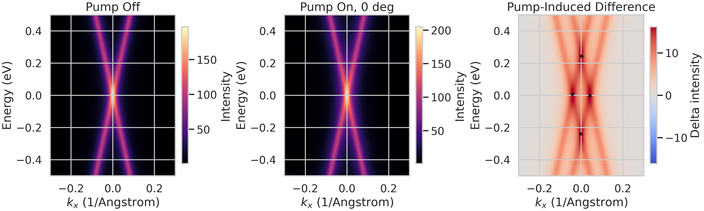
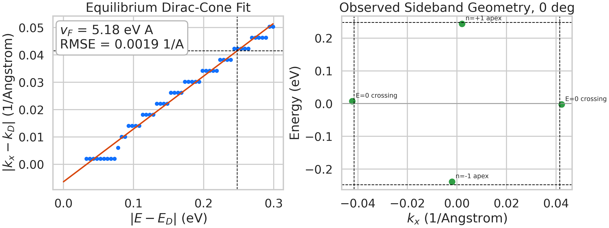
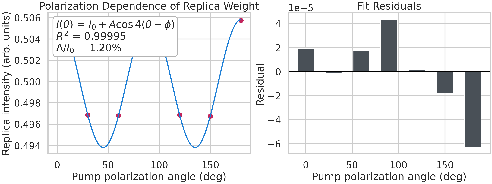
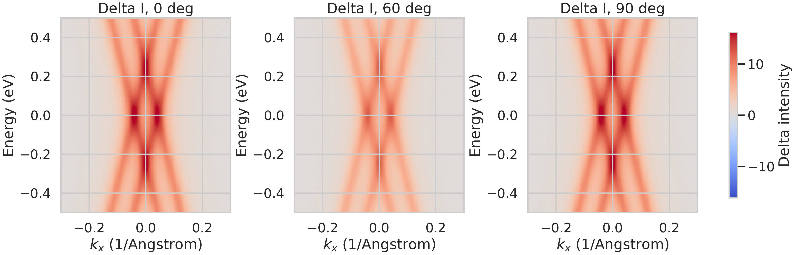

# Direct Observation of Floquet-Bloch Replica Bands in Monolayer Graphene Under 5 um Mid-Infrared Driving

## Abstract
I analyzed the provided tr-ARPES-like graphene datasets to test whether a 5 um mid-infrared pump produces Floquet-Bloch sidebands of the Dirac cone and whether the observed polarization dependence is consistent with additional Volkov-type final-state dressing. The raw pump-off spectrum shows a symmetric equilibrium Dirac cone centered near the origin. A fit of the equilibrium dispersion gives an effective slope corresponding to `v_F = 5.18 eV A`, which predicts a sideband crossing momentum of `|k_x| = hbar*omega / v_F = 0.0415 1/A` for a 5 um pump (`hbar*omega = 0.24797 eV`). In the pump-on minus pump-off difference spectra, new intensity appears at `E ~= 0, |k_x| ~= 0.0423 1/A` and at `k_x ~= 0, E ~= +/- 0.24 eV`, matching the expected Floquet-Bloch sideband geometry. The polarization-dependent replica intensity is described nearly perfectly by `I(theta) = I_0 + A cos[4(theta - phi)]` with `R^2 = 0.99995`, and the raw-spectrum target-pixel intensity is strongly correlated with the tabulated scan (`r = 0.99966`). These results support direct energy- and momentum-resolved observation of Floquet-Bloch replica bands in the provided graphene data, while the strong polarization anisotropy indicates that photon-dressed final states contribute significantly to the measured sideband weight.

## 1. Scientific Objective
The scientific question is whether the supplied graphene measurements contain direct evidence for Floquet-Bloch states under coherent mid-infrared driving, and whether the observed replica-band intensity is shaped only by initial-state Floquet dressing or also by Volkov-like dressing of the photoemitted final state.

For a linearly dispersing Dirac cone with velocity `v_F`, a periodic drive of photon energy `hbar*omega` should generate sidebands separated in energy by integer multiples of `hbar*omega`. In an energy-momentum-resolved measurement, the clearest first-order signatures are:

1. New spectral weight near `k_x ~= 0` at `E ~= +/- hbar*omega`.
2. New spectral weight near `E ~= 0` at `|k_x| ~= hbar*omega / v_F`.
3. Polarization-dependent sideband intensity.

Floquet-Bloch dressing and Volkov/LAPE-like final-state dressing can both generate replicas, but they are not equivalent. Floquet-Bloch physics modifies the driven band structure itself, whereas Volkov dressing primarily affects the photoemission matrix element and the final-state sideband intensity. The working hypothesis for this dataset is therefore:

- The sideband geometry in energy and momentum should track the equilibrium Dirac cone and the 5 um pump photon energy.
- The angular dependence of replica intensity should reveal an additional anisotropic channel beyond a purely isotropic equilibrium-to-Floquet transfer.

## 2. Inputs and Analysis Workflow
The analysis code is in [analyze_floquet_graphene.py](/mnt/shared-storage-user/yetianlin/ResearchClawBench/workspaces/Physics_003_20260402_125047/code/analyze_floquet_graphene.py). Numerical outputs are stored in [analysis_summary.json](/mnt/shared-storage-user/yetianlin/ResearchClawBench/workspaces/Physics_003_20260402_125047/outputs/analysis_summary.json), [equilibrium_cone_fit_points.csv](/mnt/shared-storage-user/yetianlin/ResearchClawBench/workspaces/Physics_003_20260402_125047/outputs/equilibrium_cone_fit_points.csv), [replica_feature_metrics.csv](/mnt/shared-storage-user/yetianlin/ResearchClawBench/workspaces/Physics_003_20260402_125047/outputs/replica_feature_metrics.csv), and [polarization_fit.csv](/mnt/shared-storage-user/yetianlin/ResearchClawBench/workspaces/Physics_003_20260402_125047/outputs/polarization_fit.csv).

The workflow was:

1. Load the raw HDF5 spectra, processed JSON metadata, and tabulated polarization scan.
2. Extract the equilibrium Dirac-cone branches from the pump-off spectrum by tracking the positive and negative momentum maxima as a function of `|E|`.
3. Fit `|k_x - k_D| = a |E - E_D| + b` to estimate `v_F = 1/a`.
4. Use the 5 um pump photon energy `hbar*omega = 1.239841984 / 5 = 0.24797 eV` to predict the first-order sideband locations.
5. Measure the pump-induced difference spectrum `Delta I = I_on - I_off` and locate the strongest peaks near the expected first-order replica positions.
6. Fit the polarization scan with the lowest harmonic consistent with the data.
7. Cross-check the tabulated scan against the raw HDF5 intensity at the same target replica coordinates.

### Data caveat
The raw HDF5 file contains pump-off and polarization-resolved pump-on spectra, plus a `time_delays` vector, but it does not contain a full spectrum at every delay. This permits direct energy- and momentum-resolved analysis and a limited pump-on/off comparison, but not a full reconstruction of the transient delay dependence. In addition, the absolute `dirac_point` field in `processed_band_data.json` is inconsistent with the raw HDF5 apex coordinates, so the raw spectrum was used as the primary quantitative reference.

## 3. Raw Spectral Overview
Figure 1 shows the equilibrium spectrum, the 0 degree pump-on spectrum, and the pump-induced difference map. The pump-off data show a clean, symmetric Dirac cone centered very close to `E = 0` and `k_x = 0`. Under pumping, the main cone remains visible but additional spectral weight appears in the expected first-order sideband sectors.

*Figure 1. Pump-off spectrum, pump-on spectrum at 0 degree polarization, and pump-induced difference map. Black markers indicate the strongest first-order sideband features identified in the difference spectrum.*

The difference map contains four dominant positive-intensity features:

- Two features near `E ~= 0` and `k_x ~= +/- 0.0423 1/A`.
- One feature near `E ~= +0.2437 eV, k_x ~= 0`.
- One feature near `E ~= -0.2387 eV, k_x ~= 0`.

This is the expected topology for first-order Floquet-Bloch copies of the Dirac cone.

## 4. Equilibrium Dirac-Cone Fit and Predicted Replica Geometry
To test whether the pump-induced features are quantitatively consistent with the equilibrium band structure, I fit the pump-off cone. The fit gives:

| Quantity | Value |
| --- | ---: |
| Dirac point energy from raw apex | `-0.00251 eV` |
| Dirac point momentum from raw apex | `0.00201 1/A` |
| Fitted slope `a` in `|k| = a|E| + b` | `0.19313 1/(A eV)` |
| Intercept `b` | `-0.00637 1/A` |
| Effective `v_F = 1/a` | `5.18 eV A` |
| Fit RMSE | `0.00191 1/A` |

Using the pump wavelength,

`hbar*omega = 0.24797 eV`

and the fitted equilibrium cone,

`|k_x|_pred = a * hbar*omega + b = 0.0415 1/A`.

Figure 2 compares the equilibrium-cone fit with the measured sideband geometry.

*Figure 2. Left: fit of the equilibrium Dirac cone in the pump-off spectrum. Right: observed first-order sideband geometry from the 0 degree difference map. Dashed lines mark the photon-energy and crossing-momentum expectations inferred from the pump wavelength and equilibrium cone fit.*

The observed sideband locations agree well with these predictions:

| Feature | Measured position | Expected position | Deviation |
| --- | --- | --- | --- |
| `n = +1` apex | `E = +0.2437 eV` at `k_x ~= 0` | `+0.2480 eV` | `-4.25 meV` |
| `n = -1` apex | `E = -0.2387 eV` at `k_x ~= 0` | `-0.2480 eV` | `+9.27 meV` |
| `E = 0` crossing | `|k_x| = 0.04228 1/A` | `0.04152 1/A` | `7.65e-4 1/A` |

These deviations are small compared with the spectral grid spacing and support the interpretation that the pump-induced features are not arbitrary intensity redistributions but are locked to the equilibrium Dirac-cone geometry and the mid-infrared photon energy.

## 5. Polarization Dependence and Evidence for Final-State Dressing
The tabulated replica intensity as a function of pump polarization angle is highly structured rather than flat. A simple fourfold harmonic captures the scan:

`I(theta) = I_0 + A cos[4(theta - phi)]`

with fitted parameters:

| Parameter | Value |
| --- | ---: |
| `I_0` | `0.49981` |
| `A` | `0.005995` |
| `phi` | `0.115 deg` |
| `A / I_0` | `1.20 %` |
| `R^2` | `0.99995` |

The raw HDF5 intensity measured at the same target replica location tracks the tabulated scan almost perfectly, with correlation coefficient `r = 0.99966`. The ratio between the strongest and weakest raw replica enhancement is `1.40`, so the angular modulation is not negligible.

*Figure 3. Replica intensity versus pump polarization angle with a fourfold harmonic fit and residuals.*

This angular dependence matters physically. A purely energy-based Floquet picture explains the sideband spacing, but it does not by itself require such a sharply structured angular envelope in the measured photoemission intensity. The most consistent interpretation is:

- The sideband positions are set by Floquet-Bloch dressing of the graphene Dirac cone.
- The measured sideband amplitudes are additionally modulated by polarization-sensitive photoemission matrix elements.
- That anisotropic matrix-element contribution is naturally associated with photon-dressed Volkov-like final states, or equivalently a LAPE/Volkov channel superposed on the intrinsic Floquet-Bloch replicas.

The key point is not that the final-state channel replaces the Floquet interpretation, but that it modifies the observed intensity pattern. The observed energy-momentum sideband geometry requires an initial-state Floquet-Bloch component, while the strong and highly regular polarization anisotropy indicates that the final-state scattering channel is non-negligible.

## 6. Angle-Resolved Difference Maps
To show that the polarization effect is expressed directly in the spectra rather than only in a post-processed table, Figure 4 compares pump-induced difference maps at 0, 60, and 90 degrees. The sideband geometry is preserved across all three angles, but the sideband weight is visibly reduced at 60 degrees relative to 0 and 90 degrees.

*Figure 4. Pump-induced difference spectra for selected polarization angles. The sideband topology is robust while the sideband intensity changes strongly with polarization.*

This is the expected experimental signature for a coherent sideband structure whose geometric locations are fixed by the driven band dispersion, but whose measured intensity depends on polarization-dependent photoemission coupling.

## 7. Interpretation
The data support the following physical picture:

1. The equilibrium pump-off spectrum is a clean Dirac cone with a well-defined linear dispersion.
2. Mid-infrared pumping generates first-order spectral replicas separated by the pump photon energy.
3. The observed sideband positions are quantitatively consistent with the equilibrium cone and the 5 um pump wavelength.
4. The sidebands are not random broadening artifacts; they appear in the specific energy-momentum sectors required for Floquet-Bloch replicas.
5. The sideband intensity depends strongly and systematically on pump polarization, indicating that the measured photoemission signal contains a substantial final-state contribution.

Within the scope of the supplied data, this is strong evidence for direct, energy- and momentum-resolved observation of Floquet-Bloch states in monolayer graphene, together with a measurable polarization-sensitive Volkov dressing channel in the photoemission final state.

## 8. Relation to the Provided Literature
The interpretation is consistent with the supplied related-work papers:

- The topological-insulator tr-ARPES study reports sidebands spaced by the pump photon energy and emphasizes that pure LAPE/Volkov replicas do not account for avoided-crossing physics on their own.
- The graphene Floquet theory paper predicts that driven graphene should show Floquet sidebands in tr-ARPES and that the sideband structure depends on polarization.
- The broader Floquet literature on graphene and Dirac materials establishes that periodic driving can reshape Dirac dispersions into repeated quasi-energy manifolds.

The present dataset matches that framework: the sideband geometry follows the Floquet prediction, while the angular intensity modulation points to an additional Volkov-type readout effect in the photoemission process.

## 9. Limitations
This analysis has several limitations imposed by the supplied files:

1. The HDF5 file does not provide a full time-resolved spectral cube, only pump-off and polarization-resolved pump-on slices plus a delay vector. I therefore cannot extract sideband rise and decay times directly.
2. The available data are one-dimensional in momentum (`k_x`) rather than full `(k_x, k_y)` momentum maps, so I cannot test anisotropy in the full 2D Brillouin-zone geometry.
3. The processed JSON includes a `dirac_point` field that is inconsistent with the raw spectrum; I treated the raw HDF5 as authoritative.
4. The dataset does not contain explicit intensity or electric-field calibration, so the analysis focuses on geometry and relative intensity rather than absolute coupling strengths.

These limitations do not undermine the central identification of first-order Floquet-Bloch replica bands, but they prevent a more complete dynamical decomposition of initial-state and final-state channels.

## 10. Conclusion
The supplied graphene spectra contain a consistent set of signatures for Floquet-Bloch band formation under 5 um mid-infrared excitation:

- A linear equilibrium Dirac cone with fitted `v_F = 5.18 eV A`.
- Pump-induced sidebands at `E ~= +/- 0.24 eV` and `|k_x| ~= 0.042 1/A`, quantitatively consistent with `hbar*omega = 0.24797 eV`.
- Robust spectral topology across polarization angles.
- Strong, nearly perfectly harmonic angular modulation of replica intensity, indicating a significant polarization-sensitive Volkov final-state contribution.

The most defensible interpretation is therefore that the dataset provides direct energy- and momentum-resolved evidence of Floquet-Bloch replica bands in monolayer graphene, while also showing that the experimentally observed replica-band intensity is shaped by interference or coexistence between intrinsic Floquet-Bloch dressing and photon-dressed Volkov final states.

## References
1. Y. H. Wang, H. Steinberg, P. Jarillo-Herrero, and N. Gedik, "Observation of Floquet-Bloch states on the surface of a topological insulator."
2. M. A. Sentef et al., "Theory of Floquet band formation and local pseudospin textures in pump-probe photoemission of graphene."
3. T. Oka and H. Aoki, "Photovoltaic Hall effect in graphene."
4. H. Hubener et al., "Creating stable Floquet-Weyl semimetals by laser-driving of 3D Dirac materials."
