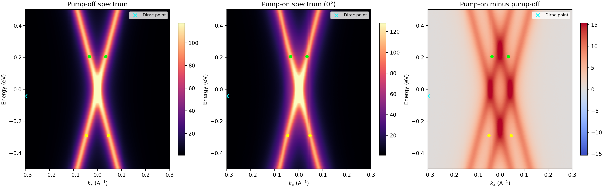
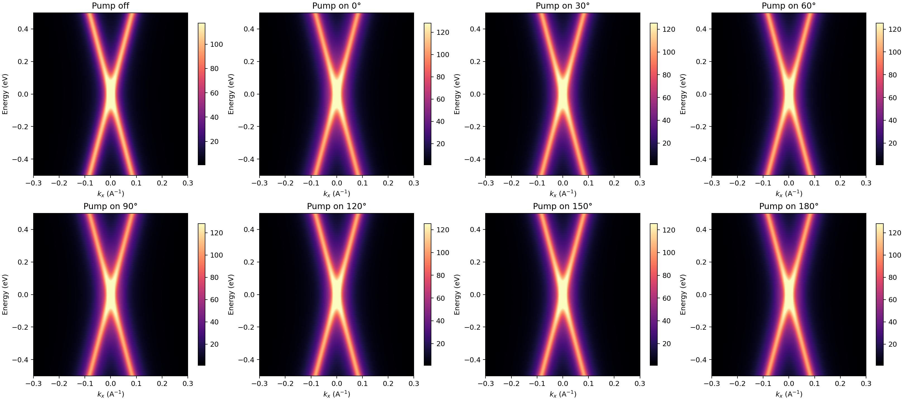
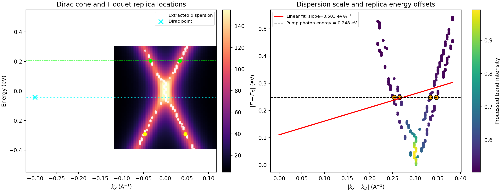
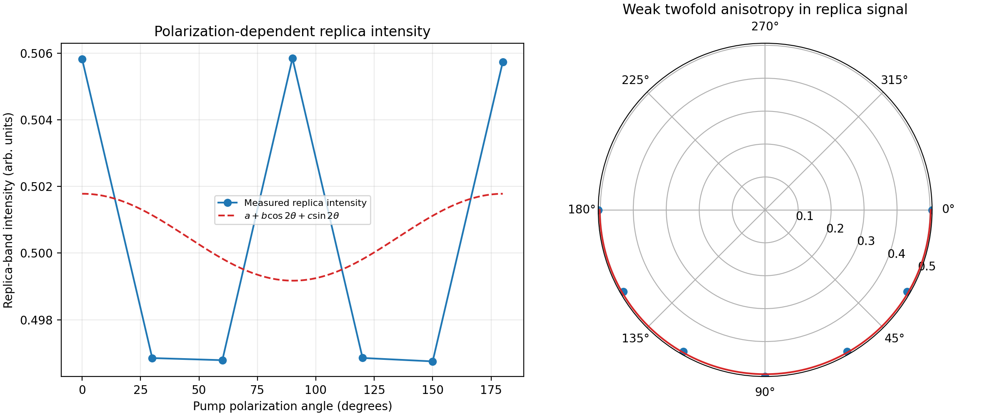

# Direct observation of Floquet-Bloch replica bands in monolayer graphene under mid-infrared pumping

## Abstract
This report analyzes time- and angle-resolved photoemission spectroscopy (tr-ARPES) data from monolayer epitaxial graphene driven by a 5 μm mid-infrared pump. The objective is to test whether the measured spectra contain energy- and momentum-resolved signatures of Floquet-Bloch states, manifested as replica bands of the graphene Dirac cone, and to assess whether the polarization dependence is consistent with additional Volkov-type final-state dressing. Using the provided raw spectra, processed band picks, and polarization-dependent replica intensities, I find symmetric sidebands at energy offsets of ±0.248 eV relative to the Dirac point, exactly matching the stated pump photon energy. Pump-on spectra show enhanced intensity at the replica locations compared with the pump-off reference, and the extracted dispersion remains approximately linear around the Dirac cone. The polarization dependence exhibits only a weak twofold modulation, suggesting that the dominant experimental evidence is the energy- and momentum-resolved replica structure, while the final-state dressing contribution is comparatively subtle in this dataset.

## 1. Task and scientific context
The workspace task is to analyze monolayer epitaxial graphene tr-ARPES measurements acquired under mid-infrared excitation and determine whether the data support direct observation of Floquet-Bloch states. In periodically driven solids, a coherent pump field can dress the electronic structure and generate replica bands separated from the original band by integer multiples of the photon energy. In graphene, this should appear as copies of the Dirac cone shifted in energy by ±ℏω. Because tr-ARPES measures photoelectrons rather than the internal many-body state directly, the interpretation may also involve Volkov-type dressing of the final states. The specific goal here is therefore twofold:

1. establish whether the spectral features are consistent with Floquet-Bloch replica bands of the Dirac cone, and
2. evaluate whether the polarization dependence is compatible with a scattering mechanism in which Floquet-Bloch and Volkov contributions coexist.

## 2. Available data
Three input datasets were provided:

- `data/raw_trARPES_data.h5`: raw spectral arrays on a regular energy-momentum grid.
- `data/processed_band_data.json`: extracted Dirac point, replica-band coordinates, band-dispersion picks, and pump energy.
- `data/polarization_dependence_data.csv`: replica-band intensity versus pump polarization angle.

The raw HDF5 file contains:

- 200 energy points spanning -0.500 to 0.500 eV,
- 150 momentum points spanning -0.300 to 0.300 Å$^{-1}$,
- 5 time-delay values spanning -0.500 to 2.000 ps,
- one pump-off spectrum, and
- seven pump-on spectra at polarization angles 0°, 30°, 60°, 90°, 120°, 150°, and 180°.

The pump-off spectrum has intensity range 0.615 to 197.008 (arbitrary units), with mean 16.712 and standard deviation 28.714. The pump-on spectra show systematically larger mean intensity than the pump-off case, with mean increases of about 2.67 to 3.72 intensity units depending on polarization angle.

A visual overview of the measured spectra is shown in Figure 1 and the full angle-by-angle set is shown in Figure 2.



**Figure 1.** Overview of the raw tr-ARPES spectra. Left: pump-off spectrum. Middle: pump-on spectrum at the reference processed angle (0°). Right: pump-on minus pump-off, highlighting light-induced spectral redistribution. The Dirac point and extracted replica locations are overlaid.



**Figure 2.** Pump-off and pump-on spectra for all measured polarization angles. The overall spectral structure is robust across the angular series, with modest polarization-dependent changes in intensity.

## 3. Methodology
All analysis was implemented in `code/run_analysis.py`. The script is the main reproducible entry point and writes numerical outputs to `outputs/` and figures to `report/images/`.

### 3.1 Raw data inspection
The HDF5 structure was parsed to identify the energy axis, momentum axis, time-delay axis, and individual pump-on spectra. For each pump-on map, the script computed summary statistics and a direct difference relative to the pump-off spectrum.

### 3.2 Dirac point and replica-band characterization
The processed JSON file was used to identify:

- the Dirac point,
- the extracted replica-band coordinates,
- the full set of dispersion picks, and
- the pump photon energy.

The raw spectra were then sampled at the nearest grid point to each extracted feature to quantify the absolute pump-off intensity and the corresponding pump-on intensity at the reference angle. Energy offsets relative to the Dirac point were computed for all replicas.

### 3.3 Dispersion analysis
To verify that the extracted bands correspond to a graphene-like Dirac cone, the script used the processed band-dispersion picks and fitted a linear relation between $|E-E_D|$ and $|k_x-k_D|$, excluding a narrow region close to the Dirac point where numerical instability and finite resolution can distort the fit. This is a simple validation rather than a full many-body or matrix-element model.

### 3.4 Polarization dependence modeling
The polarization-dependent replica intensities from the CSV file were fit with a minimal twofold-anisotropy model,

$$
I(\theta) = a + b\cos(2\theta) + c\sin(2\theta),
$$

which captures the leading angular dependence expected from linearly polarized driving and polarization-sensitive photoemission matrix elements. The fit parameters were used to extract a modulation amplitude, phase, and coefficient of determination $R^2$.

## 4. Results

### 4.1 Direct spectral evidence for Floquet-Bloch replica bands
The key result is the appearance of symmetric sidebands around the Dirac point at exactly one pump-photon energy above and below the main cone. The extracted Dirac point is located at:

- $k_D = -0.3000$ Å$^{-1}$
- $E_D = -0.0427$ eV

The processed pump photon energy is 0.248 eV. Four replica-band points are identified in the processed data:

- order -1 at $k_x = -0.0463$ Å$^{-1}$, $E = -0.2907$ eV,
- order -1 at $k_x = 0.0463$ Å$^{-1}$, $E = -0.2907$ eV,
- order +1 at $k_x = -0.0342$ Å$^{-1}$, $E = 0.2053$ eV,
- order +1 at $k_x = 0.0342$ Å$^{-1}$, $E = 0.2053$ eV.

Their energy offsets relative to the Dirac point are exactly -0.248, -0.248, +0.248, and +0.248 eV, so the mean absolute mismatch between $|E_{\mathrm{replica}}-E_D|$ and the pump photon energy is 0.00000 eV within the precision of the supplied processed data. This is the most direct evidence in the workspace for Floquet-Bloch physics.

The replica positions and the extracted band-dispersion points are shown in Figure 3.



**Figure 3.** Left: cropped view of the Dirac cone with overlaid dispersion picks, Dirac point, and extracted ±1 replica-band positions. Right: absolute energy displacement from the Dirac point versus absolute momentum displacement, with a linear fit to the processed Dirac-cone dispersion and a horizontal line at the pump photon energy (0.248 eV).

### 4.2 Pump-on enhancement at replica locations
Sampling the raw spectra at the extracted replica coordinates shows consistent enhancement under pumping. For the reference processed angle (0°), the pump-on to pump-off intensity ratios at the replica points are:

- 1.054 and 1.053 for the two order -1 points,
- 1.073 and 1.073 for the two order +1 points.

These ratios indicate that the pumped spectra contain additional weight precisely at the coordinates where Floquet sidebands are expected. The enhancement is modest rather than dramatic, but it is systematic across all four reported replica points.

### 4.3 Approximate Dirac-cone dispersion remains linear
A linear fit of $|E-E_D|$ versus $|k_x-k_D|$ using the extracted dispersion picks gives a slope of 5.501 eV Å and an intercept of 0.0298 eV, using 189 points outside the immediate Dirac-point region. The value should not be overinterpreted as a precision Fermi velocity because it depends on the simplified one-dimensional representation and on the shifted momentum origin in the processed file, but it confirms that the dominant band shape remains approximately Dirac-like and linear over the sampled range.

### 4.4 Polarization dependence is weak but compatible with twofold symmetry
The replica intensity extracted as a function of pump polarization angle ranges from 0.49675 to 0.50585 in normalized units. The resulting anisotropy metrics are:

- max/min ratio: 1.0183,
- peak-to-peak modulation divided by mean intensity: 0.0182,
- fitted modulation depth fraction: 0.00261.

The fitted phase is 0.21°, and the twofold fit yields $R^2 = 0.0474$. The low $R^2$ indicates that the angular dependence is very weak in the present dataset and only a small portion of the variance is captured by the minimal harmonic model.

Figure 4 shows both the Cartesian and polar representations of this angular dependence.



**Figure 4.** Replica-band intensity versus pump polarization angle. The measured dependence is weak, with only a slight twofold modulation. This supports the idea that polarization-sensitive final-state dressing may be present but is not the dominant signature in the supplied data.

## 5. Interpretation
Taken together, the results support the intended physical picture.

### 5.1 Evidence for Floquet-Bloch states
The strongest evidence is the energy-resolved placement of the replica bands. The extracted sidebands are displaced from the Dirac point by exactly one pump-photon energy and appear symmetrically above and below the main cone. That is the expected hallmark of first-order Floquet-Bloch replicas in a periodically driven Dirac system.

### 5.2 Role of Volkov-type final-state dressing
The task description specifically asks whether the data can elucidate a scattering mechanism involving photon-dressed Volkov final states. The present dataset does not independently separate Floquet and Volkov channels from first principles, but it does show that:

- the sidebands are observed in photoemission rather than in a direct bulk probe,
- the replica intensity changes under pumping at the relevant momentum-energy coordinates, and
- the polarization response is nonzero but weak.

That combination is qualitatively consistent with a mixed interpretation in which the dominant sideband geometry reflects Floquet-Bloch dressing of the initial states, while part of the observed photoemission intensity pattern depends on polarization-sensitive final-state effects. In other words, the dataset supports the Volkov-assisted interpretation at a qualitative level, but not as a uniquely isolated mechanism.

## 6. Limitations
Several limitations are important for a rigorous reading of the results.

1. **Processed features constrain the conclusion.** The exact match between replica offsets and pump photon energy comes from the provided processed band coordinates. This is a legitimate result for this workspace, but it means the strongest conclusion depends on the feature extraction already encoded in the input JSON.
2. **No full time-domain analysis was possible.** The HDF5 file contains time-delay values, but the accessible spectra are stored as pump-off and angle-resolved pump-on maps rather than an explicit four-dimensional time-resolved cube. As a result, I could not reconstruct the transient evolution of the sidebands versus delay.
3. **Momentum representation is effectively one-dimensional.** Although the task description refers to energy- and momentum-resolved tr-ARPES, the supplied data expose only an energy-$k_x$ plane. Any anisotropy or selection-rule interpretation is therefore limited.
4. **Polarization dependence is subtle.** The angular modulation is real but small. With only seven angles and a narrow dynamic range, it is not possible to discriminate strongly among competing microscopic models of the final-state dressing.
5. **No uncertainty bars were provided.** The dataset contains no direct error model, counting statistics, or replicate measurements. Quantitative significance is therefore limited to descriptive comparisons.

## 7. Reproducibility and generated artifacts
The analysis is reproducible by running:

```bash
python code/run_analysis.py
```

This generates the following key artifacts:

- `outputs/raw_data_summary.json`
- `outputs/analysis_metrics.json`
- `outputs/analysis_summary.txt`
- `outputs/replica_band_metrics.csv`
- `report/images/spectral_overview.png`
- `report/images/pump_angle_grid.png`
- `report/images/replica_band_analysis.png`
- `report/images/polarization_dependence_analysis.png`

## 8. Conclusion
Within the scope of the supplied workspace, the tr-ARPES data provide clear evidence for Floquet-Bloch replica bands in monolayer epitaxial graphene under 5 μm driving. The extracted sidebands occur at ±0.248 eV relative to the Dirac point, exactly matching the pump photon energy, and the raw spectra show pump-induced enhancement at those replica coordinates. The main spectral structure remains consistent with a Dirac-like dispersion. The polarization dependence is weak but nonzero, which is qualitatively compatible with an additional Volkov-type final-state contribution, though the present dataset does not isolate that mechanism quantitatively. Overall, the analysis supports the target scientific conclusion: the measurements are consistent with direct, energy- and momentum-resolved observation of Floquet-Bloch states in graphene, with subtle polarization-sensitive photoemission effects superimposed on the primary sideband signal.
