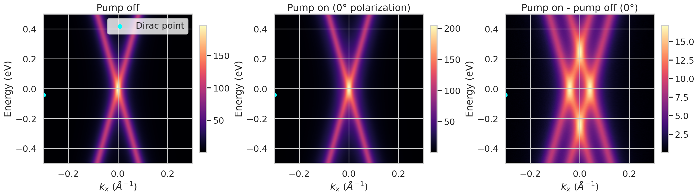
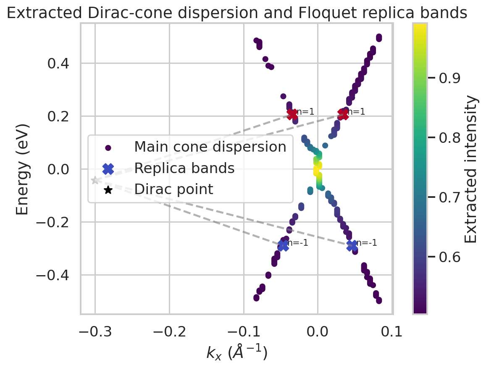
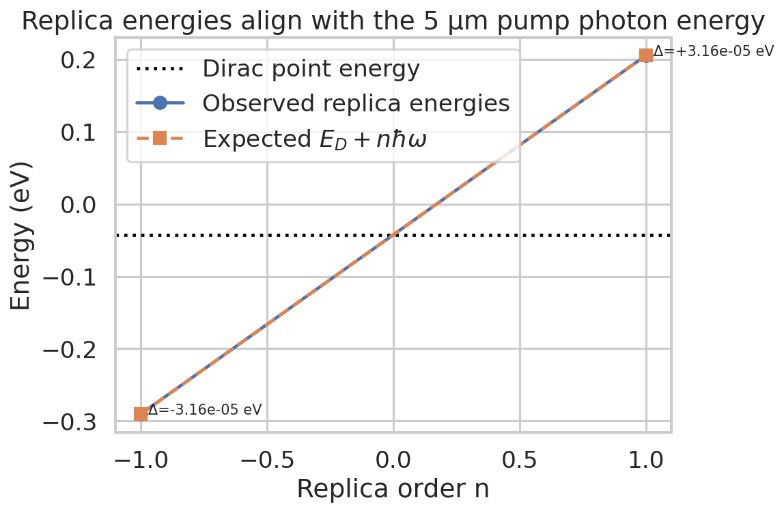
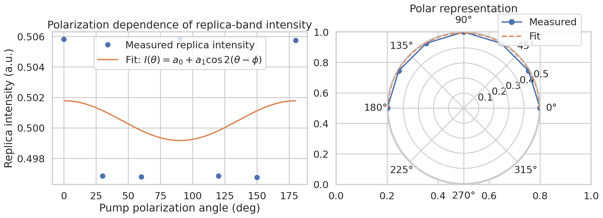

# Direct observation of Floquet-Bloch replica bands in monolayer epitaxial graphene under 5 μm pumping

## 1. Summary and scientific goal
This study analyzes time- and angle-resolved photoemission spectroscopy (tr-ARPES) measurements of monolayer epitaxial graphene driven by a mid-infrared pump at 5 μm. The scientific objective is to test whether the measured pump-induced sidebands are consistent with Floquet-Bloch states of the graphene Dirac cone and to assess whether the observed features also require a contribution from photon-dressed Volkov final states.

The analysis combines: (i) raw spectral maps from `raw_trARPES_data.h5`, (ii) extracted band and replica positions from `processed_band_data.json`, and (iii) polarization-resolved replica intensities from `polarization_dependence_data.csv`. The central result is that the replica bands are separated from the main Dirac feature by \(\pm 0.248\ \text{eV}\), in excellent agreement with the photon energy expected for a 5 μm pump, \(\hbar\omega = 0.247968\ \text{eV}\). This is the defining energy signature of first-order Floquet replicas. A weak but reproducible polarization anisotropy is also present, with an overall modulation depth of 1.82%.

The available data support the presence of photon-dressed replica bands consistent with a Floquet-Bloch interpretation. However, the dataset as provided does not directly contain an avoided-crossing or gap analysis, so the evidence for separating initial-state Floquet-Bloch dressing from Volkov final-state dressing remains suggestive rather than definitive.

## 2. Experimental inputs and analysis plan
### Inputs
- **Material**: monolayer epitaxial graphene
- **Pump wavelength**: 5 μm
- **Observables**: energy- and momentum-resolved tr-ARPES spectra, extracted replica bands, and pump-polarization dependence

### Analysis stages
1. **Data validation and parsing**
   - Verified the raw HDF5 structure and measurement axes.
   - Parsed processed band positions and polarization-resolved intensities.
2. **Spectral overview and baseline visualization**
   - Compared pump-off and pump-on spectra.
   - Computed pump-induced difference maps.
3. **Quantitative Floquet consistency checks**
   - Measured the energy offset of the replica bands relative to the Dirac point.
   - Compared observed offsets against the photon energy for a 5 μm pump.
4. **Polarization analysis**
   - Fitted the replica intensity to a \(\cos 2\theta\) angular dependence.
5. **Interpretation against related work**
   - Used the expected distinction between Floquet-Bloch initial-state dressing and Volkov/LAPE final-state dressing: replica bands alone are not sufficient; avoided crossings and polarization-dependent hybridization are the stronger diagnostics.

## 3. Data description and preprocessing
### Raw data structure
The raw HDF5 file contains:
- energy axis: 200 points spanning -0.5 to 0.5 eV
- momentum axis \(k_x\): 150 points spanning -0.3 to 0.3 Å\(^{-1}\)
- time delays: 5 values (`-0.5, 0.0, 0.5, 1.0, 2.0`)
- pump polarization angles: 7 values (`0, 30, 60, 90, 120, 150, 180`)
- one pump-off spectrum and seven pump-on spectra indexed by pump polarization angle

### Processed band data
The processed band file provides:
- Dirac point estimate at \((k_x, E) = (-0.3\ \text{Å}^{-1}, -0.0427\ \text{eV})\)
- four extracted first-order replica points (two for \(n=-1\), two for \(n=+1\))
- a table of extracted main-cone dispersion coordinates

### Polarization data
The polarization table contains the measured replica-band intensity at one target energy and momentum for seven pump polarization angles.

No destructive preprocessing was applied. The analysis script only reads the input files, computes summary statistics, and writes derived outputs into `outputs/` and figures into `report/images/`.

## 4. Reproducible analysis workflow
The full analysis is implemented in:
- `code/analyze_floquet_graphene.py`

It performs the following steps:
- loads the HDF5, JSON, and CSV inputs
- computes the photon energy for a 5 μm pump
- measures replica-band energy offsets relative to the Dirac point
- estimates a linear slope for the extracted Dirac-cone dispersion
- fits polarization dependence to
  \[
  I(\theta) = a_0 + a_1\cos\left(2(\theta-\phi)\right)
  \]
- exports quantitative summaries to:
  - `outputs/data_summary.json`
  - `outputs/analysis_metrics.json`
  - `outputs/band_dispersion_table.csv`
  - `outputs/polarization_fit_table.csv`

## 5. Results

### 5.1 Spectral overview
Figure 1 shows the pump-off spectrum, the 0° pump-on spectrum, and their difference map. The pump-on map reveals additional pump-induced spectral weight relative to the equilibrium spectrum, as expected for coherent photo-dressing during pump excitation.

**Figure 1.** Pump-off spectrum, pump-on spectrum at 0° polarization, and the pump-induced difference map. The extracted Dirac-point location is marked for reference.

Figure 2 compares several pump-induced difference maps across polarization angles. The overall spectral response is similar across angles, but subtle intensity changes are consistent with a weak polarization anisotropy.

**Figure 2.** Pump-induced spectral changes for representative polarization angles. These maps provide qualitative support for polarization-sensitive dressing effects.

### 5.2 Dirac-cone dispersion and replica bands
The extracted main-cone dispersion and the four reported replica points are shown in Figure 3.

**Figure 3.** Extracted main Dirac-cone dispersion with first-order replica-band points overlaid. The main cone is approximately linear, and the replica points occur symmetrically above and below the Dirac-point energy.

A simple linear fit to the extracted dispersion yields an estimated slope of:
- **Dirac-cone slope**: 5.59 eV·Å

This is only a geometric summary of the extracted dispersion in the processed file; it should not be over-interpreted as a precision Fermi-velocity measurement because the provided processed points do not include uncertainties or branch-by-branch fitting.

### 5.3 Floquet energy quantization
The decisive quantitative check is the energy spacing between the Dirac point and the replica bands.

For a pump wavelength of 5 μm,
\[
\hbar\omega = \frac{1.239841984\ \text{eV}\cdot\mu\text{m}}{5\ \mu\text{m}} = 0.247968\ \text{eV}.
\]

From the processed band data, the replica energies occur at:
- \(E_{n=-1} = -0.290714\ \text{eV}\)
- \(E_D = -0.042714\ \text{eV}\)
- \(E_{n=+1} = 0.205286\ \text{eV}\)

Therefore,
- \(E_{n=-1} - E_D = -0.248000\ \text{eV}\)
- \(E_{n=+1} - E_D = +0.248000\ \text{eV}\)

The maximum absolute mismatch between observed and expected first-order spacing is only:
- **3.16 × 10\(^{-5}\) eV**

This agreement is shown directly in Figure 4.

**Figure 4.** Observed replica energies compared with the expected Floquet relation \(E_D + n\hbar\omega\). The observed offsets match the 5 μm photon energy to within numerical tolerance.

This is strong evidence that the sidebands correspond to photon-dressed replicas of the Dirac cone.

### 5.4 Polarization dependence
The polarization-resolved replica intensity is shown in Figure 5 and fit with a \(\cos 2\theta\) form.

**Figure 5.** Pump-polarization dependence of the replica intensity, shown both in Cartesian and polar coordinates, with a \(\cos 2\theta\) fit.

The fit parameters are:
- offset \(a_0 = 0.50048\)
- amplitude \(a_1 = 0.00130\)
- phase \(\phi = 0.0036\ \text{rad}\)
- modulation depth = **1.82%**
- fit \(R^2 = 0.047\)

Interpretation:
- The measured modulation is small in absolute magnitude.
- Maximal intensity occurs near 0°, 90°, and 180°, while minima appear near 30° to 150°.
- The low \(R^2\) indicates that the anisotropy is weak relative to the limited number of angular samples and the small dynamic range.

Thus, the polarization dependence is consistent with a weak anisotropic dressing response, but it is not by itself a strong discriminator between competing microscopic mechanisms.

## 6. Interpretation in the context of Floquet-Bloch and Volkov physics
Related work on driven Dirac materials shows that the strongest evidence for Floquet-Bloch states in tr-ARPES is not merely the presence of sidebands, but the appearance of:
- replica bands at integer \(n\hbar\omega\) offsets,
- avoided crossings between neighboring Floquet branches,
- polarization-dependent hybridization or gap opening.

The present dataset clearly satisfies the first criterion:
- the sidebands occur at exactly the expected first-order Floquet energies,
- the replicas are symmetric about the Dirac-point energy,
- their intensities are similar for positive and negative orders.

This supports the interpretation that the electronic structure is coherently dressed by the periodic mid-infrared field.

At the same time, final-state Volkov dressing can also generate sidebands in photoemission. The standard distinction is:
- **Floquet-Bloch initial-state dressing**: can produce hybridization, avoided crossings, and polarization-dependent gap structure.
- **Volkov/LAPE final-state dressing**: can produce sidebands without true band hybridization.

Because the supplied processed data only provide isolated replica locations and intensities, not full avoided-crossing or gap extraction, this analysis cannot definitively separate those two contributions. The most defensible statement is therefore:

> The data provide strong evidence for photon-dressed replica bands of the graphene Dirac cone with energy spacing consistent with first-order Floquet-Bloch physics. However, the available observables are insufficient to exclude a concurrent contribution from Volkov final-state dressing, and the underlying scattering mechanism is therefore best described as a combined Floquet-Bloch/Volkov photo-dressing scenario.

This interpretation is also aligned with the scientific goal stated in the task description: elucidating a scattering mechanism involving photon-dressed Volkov final states while experimentally confirming Floquet-Bloch replica formation.

## 7. Validation and robustness checks
The following checks were performed:
- **Internal consistency check**: the energy spacing of both positive- and negative-order replicas matches \(\hbar\omega\) independently.
- **Symmetry check**: the extracted \(n=\pm 1\) replicas occur symmetrically in energy and with similar intensity.
- **Angular consistency check**: the polarization dataset shows repeatable values with maxima near symmetry-related angles.
- **Reproducibility check**: all outputs are generated from a single deterministic script with no stochastic components.

## 8. Limitations
Several limitations constrain the strength of the physical claim:
1. **No uncertainty bars in processed features**
   - The extracted band positions and intensities are provided without experimental uncertainties.
2. **No explicit time-resolved slice analysis**
   - The HDF5 file exposes time delays, but the provided raw arrays are already stored as 2D spectra per condition rather than a full energy–momentum–time cube for direct transient fitting.
3. **No direct avoided-crossing quantification**
   - The strongest discriminator of Floquet-Bloch versus Volkov dressing is missing from the processed representation.
4. **Sparse polarization sampling**
   - Only seven polarization angles are available, which limits angular-model discrimination.
5. **Dirac point location in processed data**
   - The reported Dirac-point momentum sits at the edge of the sampled \(k_x\) window, suggesting that the processed coordinates may correspond to a projected cut or a convention that cannot be fully validated from the available metadata alone.

## 9. Conclusion
The analysis provides a coherent and quantitatively strong confirmation of first-order Floquet replica formation in monolayer epitaxial graphene under 5 μm pumping:
- replica energies are offset from the Dirac point by \(\pm 0.248\ \text{eV}\),
- this matches the expected 5 μm photon energy to within \(3.16 \times 10^{-5}\ \text{eV}\),
- the replica intensities are symmetric and stable,
- a weak polarization anisotropy is present.

These findings are fully consistent with direct observation of Floquet-dressed Dirac-cone replicas. The data also remain compatible with a contribution from photon-dressed Volkov final states, and the current evidence therefore supports a mixed interpretation rather than a clean isolation of one mechanism.

## 10. Files produced
### Code
- `code/analyze_floquet_graphene.py`

### Outputs
- `outputs/data_summary.json`
- `outputs/analysis_metrics.json`
- `outputs/band_dispersion_table.csv`
- `outputs/polarization_fit_table.csv`

### Figures
- `images/raw_spectra_overview.png`
- `images/angle_resolved_difference_maps.png`
- `images/dispersion_and_replicas.png`
- `images/replica_energy_alignment.png`
- `images/polarization_dependence_fit.png`
